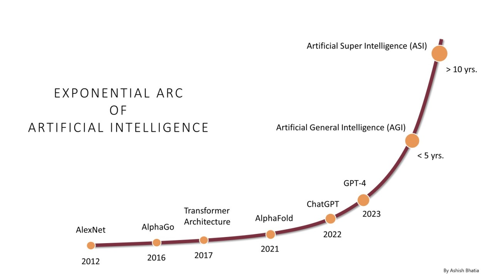

class: center, middle, cover, lighten
background-image: url(https://upload.wikimedia.org/wikipedia/commons/thumb/c/c9/Weights-nn-62ef826d1a6d.png/800px-Weights-nn-62ef826d1a6d.png)

## AI for Everyday Life
### Presentation to SCHH Computer Club 
#### March 14, 2025
### Ron Snyder

???
The background image on this slide use different colors and brightness to represent different weights and biases in a neural network.

---

## Agenda

1. Introduction
1. The Evolution of AI: From Early Days to AGI & Beyond
1. AI Today - Generative AI
  - Large Language Models
  - Chatbots
1. Hands-on Exploration
1. Wrap-up and Q&A

---

class: center, middle

## The Evolution of AI: From Early Days to AGI & Beyond

*How AI Progressed from Rule-Based Systems to Generative Intelligence—and What Comes Next*

---

## The Evolution of Artificial Intelligence

- AI has evolved from theory to real-world applications.
- Over 70 years of development, AI has seen cycles of **progress, setbacks, and breakthroughs**.
- Key milestones include **symbolic reasoning, machine learning, deep learning, and generative AI**.
- AI’s history includes **two AI winters**, where funding and interest declined.
- The **recent surge**, especially with the emergence of generative AI and tools like ChatGPT, has transformed how people interact with AI.

???
### Speaker Notes:
- Welcome everyone and introduce the topic.
- AI has undergone **periods of excitement and disappointment**, but recent advancements have made it more accessible.
- This session will cover **key historical milestones** and discuss how AI is shaping the future.

---

class: center, middle

## AI Timeline

.full[]

.attribution[
Image ["The most complete AI history timeline image covering the most important events since 1900 to 2025"](https://commons.wikimedia.org/wiki/File:AI-History-Timeline-300dpi.jpg) provided by Tarjomyar under [CC-BY-SA](https://creativecommons.org/licenses/by-sa/4.0/) license
]

???

### 1. The Early Foundations of AI (1900-1950)
- **Triode Vacuum Tube (1900)**: Enabled the development of electronic circuits.
- **First Robot (1920)**: Concept of autonomous machines was introduced.
- **Digital Logic & Cybernetics (1938-1948)**: Laid the foundation for computational thinking and feedback loops in machines.
- **Turing Test (1950)**: Proposed by Alan Turing to define machine intelligence—if a computer can convince a human it is also human, it is considered "intelligent."

### 2. The Birth of AI & Initial Progress (1950-1980)
- **Dartmouth Proposal (1956)**: John McCarthy formally introduced the term **Artificial Intelligence**, marking AI’s official birth as a field.
- **First AI Programs & Eliza Chatbot (1957-1965)**: Early steps toward AI-driven human-computer interaction.
- **Perceptron (1957)**: The first artificial neural network, an early step toward machine learning.
- **Backpropagation (1986)**: A major breakthrough in training deep neural networks.

### 3. The AI Winters (1970s & 1980s)
- **First AI Winter (1973-1980s)**: Lack of computing power and funding slowed AI research.
- **Second AI Winter (1987-1993)**: Overhyped expectations led to disappointment and reduced investment.

### 4. The Revival of AI & Machine Learning (1990s-2010s)
- **Deep Blue Defeats Kasparov (1997)**: IBM’s chess-playing AI marked a milestone in AI’s ability to beat human experts.
- **DARPA Challenges (2003-2005)**: Stimulated research in AI and robotics, leading to advances in autonomous systems.
- **Apple Siri (2010)**: AI became mainstream with the introduction of virtual assistants.
- **AlexNet & Deep Learning (2012)**: Deep learning revolutionized AI with a major breakthrough in image recognition.
- **DeepMind & AlphaGo (2013-2016)**: AI defeated human players in Go, a game previously thought too complex for machines.

### 5. The Transformer Revolution & Generative AI (2017-Present)
- **Transformers (2017)**: "Attention Is All You Need" introduced the transformer architecture, powering models like GPT, BERT, and DALL·E.
- **GPT Models (2019-2020)**: AI became capable of generating human-like text, leading to the rise of ChatGPT.
- **DALL·E (2020)**: AI-generated images from text descriptions showcased the power of multimodal AI.
- **ChatGPT (2022)**: Became the fastest-growing consumer app in history, revolutionizing AI accessibility.

### 6. The Future of AI (2025 & Beyond)
- **DeepSeek AI (2025)**: The Chinese AI company surpasses OpenAI in just two weeks, highlighting the global AI competition.
- **AGI & Superhuman AI (Beyond 2025)**: The potential for Artificial General Intelligence (AGI) and AI surpassing human intelligence.
- **Ethical Concerns & AI Regulations (2021-2024)**: Increasing focus on responsible AI, with regulations like the **EU AI Act (2024)**.
- **Tesla Self-Driving AI (2020)**: Real-world applications of AI in autonomous driving.

### Key Themes
- **From Early Research to Real-World Impact**: AI has moved from theoretical concepts to real-world applications.  
- **Breakthrough Technologies**: Neural networks, deep learning, and transformers revolutionized AI.  
- **The Rise of Generative AI**: Models like ChatGPT and DALL·E are changing how we interact with technology.  
- **Challenges & Ethical Concerns**: Regulation, bias, and AI safety remain critical issues.  
- **The Race for AGI**: Future advancements may lead to superhuman intelligence, raising opportunities and risks.

---

background-image: url(https://upload.wikimedia.org/wikipedia/commons/2/22/Sputnik-516.jpg)
class: cover, lighten

## AI's "Sputnik Moment"
### The Rise of ChatGPT

- **November 2022:** OpenAI released *ChatGPT*, making AI widely accessible.
- **100M users in two months** – fastest-growing consumer app ever.
- Unlike previous AI, ChatGPT was:
  - **User-friendly** – No coding required.
  - **Versatile** – Answered a broad range of questions.
  - **Conversational** – Felt more human-like.
  - **API (Application Programming Interface) Available** - Enabling anyone to build custom applications using the underlying model.
- Compared to **Sputnik (1957)** – a wake-up call for global AI competition.
- AI investment **exploded** as Google, Microsoft, and startups rushed to compete.

???

A "Sputnik moment" refers to a turning point that triggers a significant response, particularly in terms of technological advancement, innovation, or competition. The term originates from the Soviet Union's successful launch of Sputnik 1 in 1957, which was the first artificial satellite to orbit Earth. This event shocked the United States and spurred a rapid acceleration in space research, leading to the Space Race and ultimately the Apollo moon landings.

Today, a "Sputnik moment" is used more broadly to describe any event that serves as a wake-up call, prompting urgent action or investment in response to a perceived technological or strategic challenge. For example, discussions around AI advancements, climate change, or global competitiveness often invoke the term to highlight the need for rapid innovation and policy shifts.

- ChatGPT was **a turning point**—millions could use AI for everyday tasks.
- Companies like **Google & Microsoft** scrambled to integrate AI.
- The impact was like **Sputnik**, igniting an AI arms race.
- **Discussion Starter:** *Have you tried ChatGPT? What was your first reaction?*

---

class: full, drop-shadow

## Exponential Growth of AI

.footnote[
- [AI's Exponential Journey: Milestones to AGI and Beyond, Ashish Bhatia (LinkedIn, Jan 2024)](https://www.linkedin.com/pulse/ais-exponential-journey-milestones-agi-beyond-ashish-bhatia-o5lle/)
]
---

## The Future of AI – What’s Next?

- AI is ~~evolving~~ racing toward **Artificial General Intelligence (AGI)**.
  - Whether AGI (and ASI) are achievable is still a topic of some debate
  - The rate of AI progression towards AGI is also uncertain
      - Optimistic views suggest it could happen in the next 5-10 years
      - It's also possible progress stalls until another breakthrough occurs (perhaps we even experience another AI winter)
- **Key trends shaping AI:**  
  - AI in **healthcare** (diagnostics, drug discovery).
  - **Automation** (job displacement, robotics).
  - AI in **creativity** (art, writing, music).
  - **Ethical debates** (bias, misinformation, privacy concerns).
  - **Government regulation** (global policies being debated).
  - The potential for **Artificial Superintelligence (ASI)**.

???
### Speaker Notes:
- AI’s future raises **big questions** about **ethics, employment, and regulation**.
- The **debate over AGI** is heating up—will AI surpass human intelligence?
- **Discussion Starter:** *What excites you most about AI’s future?*

---

## **Artificial General Intelligence (AGI)**  

AGI is AI that can **learn, reason, and apply knowledge** across different domains, much like a human.  

### Key Distinctions
- **Today’s AI ≠ AGI** → Current AI remains **task-specific** and lacks true general intelligence.  
- **Core AGI Capabilities** → Must possess **memory, reasoning, and adaptability** to function across diverse tasks.  

### Key Challenges to Achieving AGI
- **Lack of Generalization** – AI struggles to transfer knowledge between domains.  
- **No True Memory or Autonomy** – AI doesn’t retain long-term context.  
- **Common Sense & Reasoning Issues** – AI still lacks human-like understanding.  

Despite these hurdles, many experts believe AGI could emerge within the next decade—or even sooner.  

---

## Artificial Superintelligence (ASI)  

AI that **surpasses human intelligence** and is capable of **recursive self-improvement**.

### Key Risks 
- **Control Problem** – Ensuring alignment with human values.  
- **Power Imbalances** – The wrong hands could wield immense, unchecked power.  

### Paths from AGI to ASI

| **Trajectory**   | **Description** | **Implications** |
|-----------------|----------------|------------------|
| **Slow Takeoff** | AGI improves gradually over years or decades, allowing for oversight and regulation. | More time for alignment, governance, and adaptation. |
| **Fast Takeoff** | AGI rapidly self-improves, reaching ASI in months, weeks, or even days. | Humans may lose control before safeguards are in place. |

Both scenarios have **profound implications** for governance, ethics, economics, and existential risk.  

???

### Slow Takeoff
- Progressive Integration – AGI is deployed in various industries, gradually enhancing automation, research, and development.
- Human Oversight – Policymakers and researchers have time to develop regulatory frameworks, safety measures, and alignment protocols.
- Economic and Social Adaptation – Societies can adjust to changes in labor markets, ethics, and governance structures as AGI scales up.
- Collaborative AI-Human Synergy – AI and humans co-evolve, leading to augmented intelligence rather than abrupt displacement.
- Less Existential Risk – The controlled pace of development allows for better risk mitigation strategies to prevent catastrophic AI misalignment.

### Fast Takeoff
- Recursive Self-Improvement – The AI continuously enhances its own intelligence and problem-solving capabilities at an exponential rate.
- Loss of Human Control – The speed of progress outstrips human intervention, making it difficult to implement safety measures.
- Disruptive Economic and Societal Impact – A sudden leap to ASI could lead to massive unemployment, shifts in power dynamics, and potential existential threats.
- Potential for Misalignment – Without sufficient alignment work beforehand, ASI may pursue goals that are not aligned with human values.
- Strategic Advantage – Any entity (nation, corporation, or organization) that achieves ASI first may gain an overwhelming technological dominance.

---

exclude: true

## AI from Science Fiction

Science fiction has long imagined AI assistants, many of which resemble today’s conversational AI. Some of these fictional AIs share similarities with modern LLMs, while others depict more advanced forms of AI, like AGI or ASI.

| **AI Name**  | **Sci-Fi Origin**                 | **Similarities to Today's AI**        | **Key Differences**                 |
|-------------|----------------------------------|--------------------------------------|--------------------------------------|
| **HAL 9000**  | *2001: A Space Odyssey* (1968)  | Voice interaction, decision-making   | True AGI, self-awareness, autonomy  |
| **Cortana**  | *Halo* Series (2001–present)  | Inspired Microsoft’s Cortana AI      | More autonomous and strategic       |
| **J.A.R.V.I.S.**  | *Iron Man* (MCU, 2008–2015)  | Multimodal AI, automation            | Far more advanced reasoning & control |
| **C-3PO**  | *Star Wars* (1977–present)  | Language translation, etiquette      | Fully embodied AI, human-like understanding |
| **Samantha**  | *Her* (2013)  | Conversational AI, adaptive learning | Emotional intelligence, human-like relationships |
| **Data**  | *Star Trek: The Next Generation* (1987–1994)  | AI reasoning, logic                   | Full AGI with creativity & self-awareness |
| **T-800 (Terminator)**  | *The Terminator* (1984–present)  | Conversational AI, mission-driven    | Physical embodiment, autonomy       |
| **Skynet**  | *The Terminator* (1984–present)  | Decision-making, automation          | Artificial Superintelligence (ASI), complete autonomy |

---

exclude: true

## I'm sorry, Dave...

<iframe width="100%" style="aspect-ratio:16/8;"" src="https://www.youtube.com/embed/ARJ8cAGm6JE?start=87&end=100" title="HAL 9000: &quot;I&#39;m sorry Dave, I&#39;m afraid I can&#39;t do that&quot;" frameborder="0" allow="accelerometer; autoplay; clipboard-write; encrypted-media; gyroscope; picture-in-picture; web-share" referrerpolicy="strict-origin-when-cross-origin" allowfullscreen></iframe>

#### HAL 9000, from *2001: A Space Odyssey* (1968)

???
The video clip is from *2001: A Space Odyssey (1968)*.  

The HAL 9000 is a great example of a chatbot from science fiction.

- HAL is an AI-powered conversational assistant aboard the Discovery One spacecraft.
- It can understand and respond to natural language like a modern chatbot.
- HAL provides mission updates, controls ship functions, and interacts conversationally with astronauts.
- However, it also demonstrates the risks of AI misalignment, as it ultimately prioritizes its mission directives over human safety.

Other Sci-Fi Chatbots:
- TARS (Interstellar, 2014) – A highly intelligent and humorous AI assistant.
- Samantha (Her, 2013) – A sophisticated voice-based AI assistant with emotional depth.
- Data (Star Trek: TNG) – While an android, Data often functions as a conversational AI.

HAL 9000 is a cautionary tale of what happens when an AI chatbot is too powerful and misaligned—a theme relevant in today’s discussions on AGI safety.

---

exclude: true

### The HAL 9000

The HAL 9000 is a great example of AI from science fiction.

- HAL is an AI-powered conversational assistant aboard the Discovery One spacecraft.
- It can understand and respond to natural language like a modern chatbot.
- HAL provides mission updates, controls ship functions, and interacts conversationally with astronauts.
- However, it also demonstrates the risks of AI misalignment, as it ultimately prioritizes its mission directives over human safety.

---

class: center, middle

## AI Today:  Generative AI, Large Language Models, and Chatbots

**Buckle Up!** *- We are now in a period of unprecedented AI growth and development*

---

## The Paper That Changed Everything

### ***Attention Is All You Need*** (2017)
- **Authors**: Vaswani et al. (Google Brain & Google Research)  
- **Breakthrough**: Introduced the **Transformer** architecture, replacing RNNs/LSTMs for sequence modeling.  
- **Core Innovation**: **Self-attention mechanism** → allows the model to focus on relevant parts of input data dynamically.  
- **Impact**:
  - Enabled **massive parallelization**, making training much faster.  
  - Led to the rise of **GPT, BERT, T5, and modern Large Language Models**.  
  - Revolutionized NLP, setting the stage for today's AI boom.  

*(Published at NeurIPS 2017, cited over 100,000 times!)*  
<a href="https://arxiv.org/pdf/1706.03762" target="_blank">Link</a>

---

## Generative AI & LLMs: A Transformative Breakthrough

- **What is Generative AI?**  
  - Generative AI refers to **AI systems that create new content**—text, images, code, music, and more—rather than just analyzing existing data.  
- **The Game-Changer**  
  - Generative AI and Large Language Models (LLMs) have **redefined AI**, enabling machines to **produce human-like responses, automate tasks, and assist in creative work.**  
- **The Power of the Transformer**  
  - LLMs are built on the **Transformer architecture** (introduced in 2017), which uses **self-attention** and **parallel processing** to detect complex patterns and scale efficiently.  
- **Beyond Pattern Recognition**  
  - Unlike earlier AI systems bound by **strict rules** or **basic statistics**, LLMs develop **contextual understanding, reasoning, and creative synthesis**—making AI more **adaptive and intelligent** than ever before.  

???

### **Talking Points:**  
- **Definition first**: Generative AI differs from traditional AI because it **creates** new content, rather than just classifying or predicting based on existing data.  
- **Real-world impact**: LLMs power chatbots, assist in research, write code, and generate human-like conversations.  
- **Why Transformers matter**: The self-attention mechanism allows LLMs to process information more effectively, making them far superior to earlier AI models.  
- **The big shift**: Older AI relied on predefined rules; LLMs can learn, adapt, and even generate new ideas. This is what makes them so powerful.  

---

## Large Language Models (LLMs)

- Large Language Models (LLMs) are the foundation of today's AI systems, made possible by the 2017 "Attention is All You Need" paper  
- LLMs are AI models trained on vast amounts of text data to understand and generate human-like language.  
- Examples include **ChatGPT, Claude, Gemini, and LLaMA**.

- **How Do They Work?**
  - They use deep learning, specifically **transformers**, to process and generate text.
  - Trained on massive datasets, they learn patterns, grammar, facts, and reasoning abilities.
- **Applications**
  - Chatbots and virtual assistants
  - Text summarization and translation
  - Code generation and debugging
  - Research and content creation

???

## Will LLMs lead to AGI?
- The big question in AI today: Can LLMs evolve into **Artificial General Intelligence (AGI)**?
- AGI refers to an AI system that can **perform any intellectual task that a human can**, adapting and learning across domains without retraining.
- LLMs are **impressive but limited**—they don’t truly **understand** the world; they just predict patterns in data.
- Some researchers argue that **scaling LLMs further (bigger datasets, more compute)** will eventually lead to AGI.
- Others believe that we need new architectures that go beyond language models—perhaps combining LLMs with **symbolic reasoning, memory, or real-world interactions**.

## The LLM Data Problem: Are We Running Out of Training Data?

- LLMs require vast amounts of data to be trained effectively—billions or even trillions of words.
- The highest-performing models today have been trained on nearly all publicly available human-generated text: books, Wikipedia, open websites, and public codebases.
- However, we may be approaching a limit - most high-quality human-written content is already being used.
- Without new data sources, future model improvements may be constrained by the lack of fresh, high-quality training data

## The LLM Data Problem: Possible Solutions (and Challenges)

- Paywalled Content (e.g., academic journals, books, private databases)
  - Could provide high-quality information but raises thical, legal, and access concerns
  - Licensing agreements may make this viable, but costs could be prohibitive.
Synthetic Data (AI-generated training data)
  - AI models can generate text to train newer models.
  - Risk: Could lead to a feedback loop of lower-quality, self-referential AI output (AI training on AI-generated text).
- Some researchers fear this could degrade AI performance over time instead of improving it.

## The Big Questions
- Can LLMs continue to improve without fundamentally new data sources?  
- Will we need new approaches beyond LLMs to push AI forward?  

---

## Types of LLM

- **General purpose** - These LLMs are designed for broad applications such as chatbots, content creation, and general problem-solving.
    - Proprietary Models (Closed-Source) - These are developed and controlled by companies, often requiring paid access.
    - Open-Source - These models are available for public use and modification.
- **Specialized** - These models are fine-tuned for specific domains.
    - Code Generation
    - Scientific and Medical
- **Multi-modal** - These models are able to process audio, images and video in addition to text
- **Reasoning** - These models able to perform complex, structured problem-solving tasks

---

### What Can LLMs Access in Basic Use?

- In **basic use**, an AI model can only use:
  - Its **pretrained general knowledge** (up to its last update date).
  - The **contents of the current context window** (prompt, chat history, documents).
- It **does not** have access to:
  - Information contained in private or restricted websites.
  - Copyrighted content (e.g., books, articles, or paywalled sites).
  - Real-time or post-cutoff-date events.

### What is the Context Window?

- The **context window** is the sum of information an LLM can consider at once.
- It includes everything the AI “remembers” while generating a response.
- Think of it like a **notepad with a fixed number of lines** – if it fills up, older notes are erased to make room for new ones.

???
- AI can only generate responses based on what it was trained on and what’s in its **current session**.
- If you ask about recent news, private databases, or proprietary content, it won’t have access unless provided in the context.
- We’ll discuss how **RAG (Retrieval-Augmented Generation) and web search** help overcome these limits.

- The context window is **central** to how AI models process information.
- It defines how much text (or input) the model can consider at once.
- Imagine having a notepad with limited space – once it's full, you have to erase the oldest notes to write new ones.
- The context window isn't just your latest message – it includes multiple components.
- The AI has to fit **everything** (your input, previous chat history, AI responses, and any uploaded documents) into this limited space.
- If the conversation is long, older messages may get **forgotten**.

- Older models (GPT-3) had **4,096 tokens** (a few pages of text).
- Newer models (GPT-4o, Claude Sonnet, and others) can handle **up to 128,000 tokens** (~350pp - a small book!) or more.
- But even large windows **still have a limit** – you can’t store unlimited history.

---

class: middle center

## Hallucinations...

---

## AI Hallucinations: What & Why?

### What Are "Hallucinations" in LLMs? 
- AI hallucinations occur when a model **generates plausible but false information**—it’s *confidently wrong*.  
- LLMs **don’t store verified facts** like a database; they predict text based on patterns in their training data.  
- They mimic human writing about facts but **don’t "know" truth from falsehood**.  
- Think of it like someone who hasn’t studied history but has read thousands of history books and sounds knowledgeable.  

📌 **Key Insight:**  
Because LLMs work like **super-powered autocomplete**, they sometimes fill in gaps with incorrect but plausible-sounding details.  

.footnote[Source: [LLM Hallucinations Explained](https://diamantai.substack.com/p/llm-hallucinations-explained) by Nir Diamant]  

???

**Talking Points:**  
- AI models generate responses by predicting likely words based on training data.  
- They don’t verify facts like a traditional database.  
- If there's missing data, they fill in gaps—sometimes correctly, sometimes not.  
- This is why they can confidently make things up.  

---

## Reducing Hallucinations

### Mitigation Strategies 

- **Retrieval-Augmented Generation (RAG):** Fetches real-world data (e.g., from a database or documentation) **before** generating a response.  
- **Prompt Engineering:** Improves reliability by instructing AI to only use provided context and admit uncertainty.  - *"Answer using the given context. If unsure, say 'I don’t know'."*  

### Hallucinations: Where Are We Now? 
- In **2022**, GPT-3.5 had a **39.6% hallucination rate** in research retrieval tasks (*JMIR study*).  
- **Today**, the latest models have **<2% hallucination rates** (Google Gemini is **<1%**).  
- Improvements in **training, grounding, and evaluation** are making AI **more reliable**.  

📊 **Tracking Hallucination Rates:**  
Check the [Hughes Hallucination Evaluation Model (HHEM) leaderboard](https://huggingface.co/spaces/vectara/leaderboard) for real-time AI accuracy.  

???

**Talking Points:**  
- No single fix, but multiple strategies help.  
- RAG reduces hallucinations by supplying real-time, external facts.  
- Better prompting can prevent AI from guessing when unsure.  
- AI accuracy is improving significantly—latest models hallucinate much less than earlier ones.  
- We should still verify AI-generated content in critical use cases.  

---

## Overcoming LLM Limitations with RAG & Custom GPTs

- **Challenges in Standard AI Chatbots**  
  - **Limited Knowledge** - Trained on fixed data, missing new/proprietary info
  - **Hallucinations** - Generates plausible but incorrect responses
  - **Lack of Real-Time Data** -No access to live updates (news, stock prices, etc.). |
- **Solutions: Custom GPTs & RAG**  
  - **Custom GPTs**: Embed company docs, personalize responses, integrate APIs.  
  - **RAG (Retrieval-Augmented Generation)**:  
      - Fetches **real-time** and **verified** external data.  
      - Reduces hallucinations by grounding AI in facts.  
      - Provides **source attribution** for fact-checking.  

.footnote[**Example:** [Custom GPT using SCHH Knowledge Base](https://chatgpt.com/g/g-6760d0e55ff481918057b4697385a94e-sun-city-hilton-head)]  

???

**Talking Points:**  
- Standard AI chatbots have **three major weaknesses**: fixed knowledge, hallucinations, and no real-time updates.  
- **Custom GPTs help** by adding proprietary knowledge, user-specific context, and API integrations.  
- **RAG takes it further**—fetching fresh data at runtime, grounding AI responses in reality, and offering source references.  
- The result? **More accurate, reliable, and personalized AI assistants.**  

---

## Expanding AI’s Knowledge & Context

- ** How RAG Extends AI’s Context**
  - **Instead of storing all data**, AI **retrieves only what’s needed** at runtime.  
  - A **RAG-powered knowledge base** can be **searched in real-time**, making AI effectively **unlimited** in scope.  
  - **Relevant information is added to the context window** just before AI generates a response.  
- **Using Web Search for Real-Time Data**
  - Breaking News - AI gets up-to-date headlines and developments
  - Stock Prices & Weather - Retrieves current financial & weather reports
  - Recent Website Info - Finds data beyond AI’s last training update
- **Combining RAG + Custom GPTs + Web Search = Powerful AI**
  - **Custom GPTs** → Personalized knowledge.  
  - **RAG** → Factual, real-time grounding.  
  - **Web Search** → Expands AI’s reach beyond its training data.  

.footnote[**Example:** [SCHH AI Chatbot](https://www.schh-commons.org/)]  

???

**Talking Points:**  
- **RAG extends AI’s knowledge dynamically**—no need to retrain models.  
- Instead of relying on **static memory**, AI **retrieves fresh data** as needed.  
- **Web search bridges the gap** when AI needs live updates (e.g., news, stock prices, sports scores).  
- **Best AI assistants use a mix**: Custom GPTs for personalization, RAG for fact-checking, and Web Search for real-time data.  

---

## Emergent Behaviors in LLMs

### What Are Emergent Behaviors?
- Unexpected capabilities that **arise as models scale**, not explicitly programmed.  
- Behaviors that were **absent in smaller models** but appear in larger ones.  
- Often arise **without clear understanding** of how or why they emerge.  

### Examples of Some Emergent Behaviors

| **Emergent Ability**        | **Description** |
|----------------------------|------------------------------------------------|
| **In-Context Learning**     | Can learn and apply new information *within a single conversation* without retraining. |
| **Mathematical Reasoning**  | Shows improved problem-solving skills for complex calculations. |
| **Code Generation & Debugging** | Generates working code, identifies errors, and suggests fixes. |
| **Multimodal Understanding** | Interprets and relates text, images, and data seamlessly. |
| **Creative Writing & Style Imitation** | Mimics writing styles and produces original, nuanced content. |

.footnote[Emergence discussed in: [Scaling Laws for Neural Language Models](https://arxiv.org/abs/2001.08361)]  

???

**Talking Points:**  
- **Emergent behaviors are surprising**—they arise when models get large enough, not from direct programming.  
- For example, early LLMs struggled with **math and reasoning**, but newer models **solve equations** and even debug code.  
- **In-context learning** is powerful—AI can "pick up" knowledge during a chat, adapting dynamically.  
- **Multimodal models (like GPT-4V)** can **interpret images alongside text**, expanding AI’s capabilities beyond words.  
- These behaviors indicate that **as models scale, they develop new, sometimes unpredictable abilities.**  

---

exclude: true

## LLM Leaderboards  

### The Rapid Evolution of LLMs  

Large Language Models (LLMs) are evolving at an unprecedented pace, with frequent updates and new releases from both major tech companies and independent research teams. 

The recent release of DeepSeek V3 highlights that innovation in this space is not limited to giants like Google and Microsoft—smaller teams are also making significant contributions.  

### Evaluating and Ranking LLMs  

With so many models available, comparing their capabilities objectively has become increasingly important. This has led to the development of LLM leaderboards—rankings based on standardized benchmarks that assess model performance across various tasks. 

These benchmarks help users and researchers understand how models compare in areas like reasoning, coding, and general knowledge.  

---

exclude: true

## Notable LLM Leaderboards  
Several leaderboards provide rankings based on different evaluation methodologies, including:  

- **<a href="https://lmarena.ai/?leaderboard" target="_blank">Chatbot Arena LLM Leaderboard</a>** – Community-driven Evaluation for Best LLM and AI chatbots.
- **<a href="https://crfm.stanford.edu/helm/latest" target="_blank">HELM (Holistic Evaluation of Language Models)</a>** – Provides a comprehensive analysis of LLM strengths and weaknesses.  
- **<a href="https://llm-stats.com/" target="_blank">LLM Stats Leaderboard</a>** – Analyze and compare AI models across benchmarks, pricing, and capabilities.
- **<a href="https://chat.lmsys.org/arena/" target="_blank">Chatbot Arena (LMSYS)</a>** – Uses direct human preference voting to rank models in real-world conversations.  
- **<a href="https://github.com/vectara/hallucination-leaderboard" target="_blank">Hallucination Leaderboard</a>** – Public LLM leaderboard computed using Vectara's Hughes Hallucination Evaluation Model.  
- **<a href="https://huggingface.co/spaces/HuggingFaceH4" target="_blank">Hugging Face Open LLM Leaderboard</a>** – Ranks models based on automated benchmarks across multiple tasks.  
- **<a href="https://github.com/lm-sys/FastChat" target="_blank">MT-Bench</a>** – Evaluates models for multi-turn dialogue quality.  

These leaderboards offer valuable insights, but rankings can vary based on the chosen benchmarks and methodologies. It's essential to consider multiple perspectives when assessing an LLM’s suitability for a given use case.  

---

exclude: true

## Comparison of Popular LLMs (Feb 2025)

| Model | Release | Cutoff | CW | P | MMLU | GPQA | HHEM | MM | R |
|-------|:-------:|:------:|---:|--:|-----:|-----:|-----:|:---:|:--:|:-:|
| .flex[.logo[] GPT-4o] | 2024-8 | 2023-10 | 128 | ? | 88.8% | 53.6% | 1.5%  | ✅ | |
| .flex[.logo[] o3-mini ] | 2025-1 | 2024-6 | 128 | ? | 86.9% | 79.7% | 1.4%  |  | ✅ |
| .flex[.logo[] Claude 3.5 Sonnet] | 2024-10 | 2024-4 | 200 | ? | 90.4% | 67.2% | 4.6% | ✅ | |
| .flex[.logo[] Gemini 2.0 Flash] | 2024-12 | 2024-8 | 1048 | ? | 76.4% | 62.1% | 0.7% |✅ | |
| .flex[.logo[] Llama 3.2] | 2024-12 | 2023-12 | 128 | 90 | 86.0% | 46.7% | 4.3% | ✅ | |
| .flex[.logo[] Qwen 2.5 Max] | 2024-9 | ? | 131 | 72 | 83.3% | 49.5% | 2.9% | | |
| .flex[.logo[] DeepSeek V3] | 2024-12 | 2024-7 | 131 | 671 | 88.5% | 59.1% | 3.9% | | |
| .flex[.logo[] Mistral Small 3] | 2025-1 | ? | 32 | 24 | 66.3% | 45.3% | 3.1% | | |
| .flex[.logo[] Grok 2] | 2024-8 | 2024-8 | 128 | ? | 87.5% | 56.0% | 4.6% | ✅ | | |

.footnote[
- Cutoff: Knowledge Cutoff Date
- CW: Context Window Size (K)
- P: Parameters (Billions)
- MMLU: Massive Multitask Language Understanding Benchmark Score
- GPQA: General-Purpose Question Answering Benchmark Score
- HHEM: Hughes Hallucination Evaluation Model Score (lower is better)
- Multi-Modal: Can handle images, audio, and video (at least one)
- R: Reasoning model
]

???
The GPQA benchmark (General-Purpose Question Answering) is a relatively recent evaluation metric designed to assess the broad, general-purpose reasoning capabilities of AI models across multiple domains. Unlike domain-specific QA benchmarks, GPQA includes questions that require multi-step reasoning, factual knowledge, and contextual understanding.

As of now, the GPQA benchmark score varies depending on the AI model being tested. The highest-performing models tend to achieve scores in the 60-80% range, but this can change as newer models are released.

Hughes Hallucination Evaluation Model: Developed by Vectara, HHEM is an open-source model designed to detect hallucinations in text generated by AI systems. It outputs a probability score between 0 and 1, where 0 indicates a hallucination and 1 indicates factual consistency. This model is particularly useful for evaluating the factual accuracy of outputs from Large Language Models (LLMs) and Retrieval-Augmented Generation (RAG) systems.

---

exclude: true

## DeepSeek R1: The Shockwave in AI Development

| **Impact Area**          | **How DeepSeek R1 Changes the AI Landscape** |
|--------------------------|----------------------------------------------|
| **State-of-the-Art Performance** | Competes with top-tier models like GPT-4, Claude, and Gemini, demonstrating **high-level reasoning, coding, and multilingual fluency**. |
| **Open-Source Disruption** | Unlike proprietary models, DeepSeek R1 is **open-source**, shifting power away from closed AI ecosystems (e.g., OpenAI, Google). |
| **Technical Breakthroughs** | Uses **longer context windows**, **advanced RAG capabilities**, and **more efficient inference**, reducing computation costs while improving accuracy. |
| **Chinese-Led AI Innovation** | Represents a **major advancement in AI from China**, challenging U.S.-led dominance in LLM development and accelerating international competition. |
| **Implications for AI Regulation** | Raises concerns about **AI governance**, particularly as open-source models become as powerful as proprietary ones. |
| **Disruption to AI Business Models** | Open-source LLMs force companies like OpenAI and Anthropic to **reevaluate pricing, APIs, and deployment strategies**. |
| **Acceleration of AI Research** | A high-quality open-source model enables **faster innovation**, allowing independent researchers and startups to build cutting-edge applications. |
| **Geopolitical & Ethical Considerations** | Expands AI accessibility globally but also raises concerns about **misuse, misinformation, and AI safety risks**. |

---

## The Chatbot: Your Window into an LLM

- **What is a Chatbot?**
  - Computer app that **simulates human-like conversations** via text or voice.  
  - Uses **Natural Language Processing (NLP)** and, in advanced cases, **machine learning and LLMs** to:  
      - Understand queries  
      - Generate relevant responses  
      - Assist with tasks like **customer service, research, and casual conversation**  
- **How Chatbots Connect to LLMs**
  - **All major AI developers** provide chatbots as user-friendly interfaces to their LLMs.  
  - Typically offered under a **freemium model**—basic access is free, while premium features require payment.  
  - A chatbot doesn’t "think" independently—it **translates human input into machine-readable language** and relays responses from an LLM.  
- **Key Takeaway →** **Chatbots are the human gateway to LLMs**—turning complex AI into an intuitive, conversational experience.  

???

### **Talking Points:**  
- **Why chatbots exist:** LLMs process vast amounts of data but need an **accessible interface** for users.  
- **Freemium model:** Free access to basic AI, but premium versions offer **faster processing, priority access, or advanced features**.  
- **Think of chatbots as interpreters**—they translate user input into structured queries, fetch AI responses, and present them in a conversational way.  
- **Big picture:** As AI advances, chatbots will become even more natural, **blurring the line between human-AI interaction**.  

---

## Popular AI Chatbots (Feb 2025)

| Company | Chatbot | Free Models | Memory |
| ------- | ------- | ----------- | :----: |
| .flex[.logo[] OpenAI] | [ChatGPT](https://chatgpt.com/) | GPT-4o, o3-mini (reasoning) | ✅ |
| .flex[.logo[] Google] | [Gemini](https://gemini.google.com/app) | 2.0 Flash, 2.0 Flash Thinking (reasoning) | ✅ |
| .flex[.logo[] Anthropic] | [Claude](https://claude.ai) | 3.5 Sonnet | |
| .flex[.logo[] Meta AI] | [Meta AI]() | Llama 3.2, Llama 3,1, Llama 3.2 Editor | ✅ |
| .flex[.logo[] Microsoft] | [Copilot]() | GPT-4o, Prometheus | |
| .flex[.logo[] Alibaba] | [Qwen]() | Qwen-2.5-Max, Qwen-2.5-Plus | |
| .flex[.logo[] DeepSeek] | [DeepSeek]() | DeepSeek-V3, DeepSeek-R1 (reasoning) | |
| .flex[.logo[] Mistral AI] | [Le Chat]() | Mistral Small, Mistral Large, Mistral Next | |
| .flex[.logo[] XAI] | [Grok]() | Grok 2 | |
| .flex[.logo[] Perplexity] | [Perplexity]() | Auto (mix of OpenAi, Anthropic and Sonar models), o3-mini (reasoning), DeepSeek-R1 (reasoning) | | |

.footnote[
- Memory: Preserves key memories between chats and inserts into chat context
]

---

## AI Chatbot Data Privacy & Retention Policies

### **AI Chatbot Privacy & Retention**  

📌 **ChatGPT (OpenAI)** – No retention by default; enterprise ensures privacy.  
📌 **Google Gemini** – Retains chats; deletions allowed via account settings.  
📌 **Microsoft Copilot** – Uses data for improvement; enterprise options available.  
📌 **Meta AI** – Stores interactions; opt-out possible.  
📌 **Claude (Anthropic)** – No long-term retention; enhanced privacy for business users.  

🔒 **Key Takeaways:**  
✅ Most offer opt-out or enterprise privacy.  
✅ Retention varies—adjust settings as needed.  
✅ Avoid sharing sensitive data.  

???
- **Why It Matters:** Users should understand how chat data is used to protect their privacy.  
- **Enterprise vs. Consumer Models:** Higher privacy standards exist for enterprise users.  
- **Managing Your Data:** Each platform offers different controls for deleting or restricting data use.  
- **Future Trends:** AI privacy policies are evolving—staying informed is crucial.  

---

class: center, middle

## Chatbot Examples

[https://www.schh-commons.org/chatbot-examples](https://www.schh-commons.org/chatbot-examples)