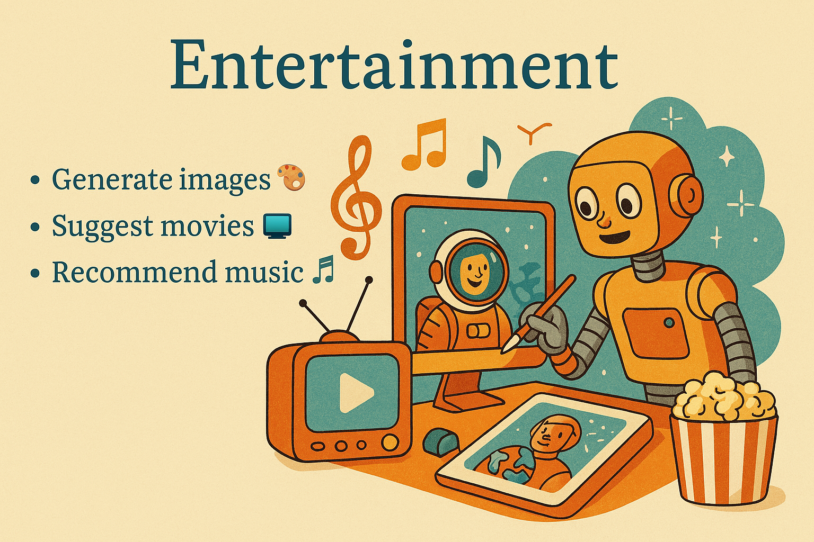
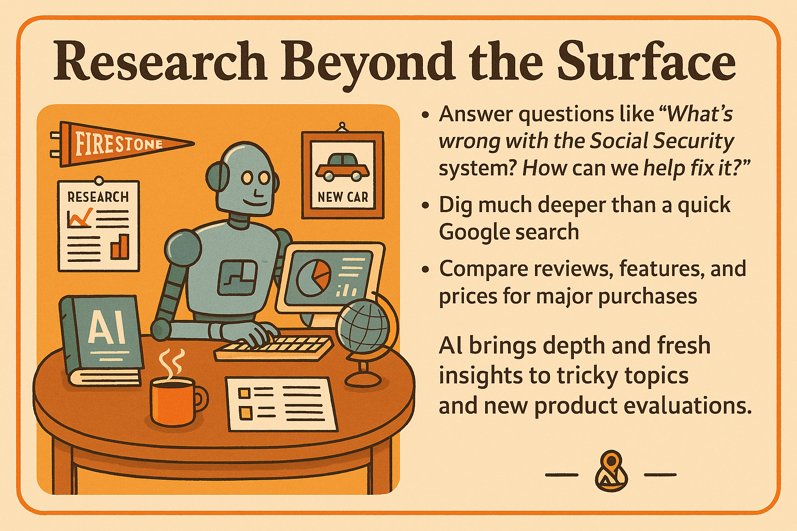

class: center, middle

.full[]

# AI for Everyday Life  
### How We Got Here — And What You Can Do With It  
#### Presented by Ron Snyder

---

class: center, middle

.full[]

???
## Today’s Journey  
### What We’ll Explore Together

- 🧠 A Gentle History of AI  
- 🛰️ The Big Leap: ChatGPT and the AI Boom  
- 💬 What Makes Generative AI Different  
- 🔎 Common Uses — From Bird ID to Budgeting  
- 🛠️ Live Examples and Demos  
- 🎤 Your Questions and Ideas

---

class: center, middle

.full[]

???
## The Dream of Thinking Machines  
### 1950s–1970s

- In the 1950s, researchers began dreaming of machines that could think like humans. The term *Artificial Intelligence* was coined in 1956 at a Dartmouth workshop attended by pioneers like Marvin Minsky and John McCarthy.
- The early belief was that if we could model human logic, we could teach it to computers — like a recipe for thought.
- But human intelligence turned out to be more complicated than expected. Understanding context, emotion, or even language was far beyond the computers of the time.
- Still, this was the start — the moment the seed of AI was planted.  
---

class: center, middle

.full[]

???
## The AI Winter  
### 1970s–1980s

- Optimism faded as it became clear that early AI systems couldn't live up to the hype — they struggled with anything outside of narrow, rule-based tasks.
- Computers weren’t powerful enough, and the "intelligent" programs of the time were brittle and limited.
- Funding dried up, enthusiasm waned, and AI entered a long quiet period — later called the *AI Winter*.
- But in the background, some researchers kept going. They explored new ideas that would quietly set the stage for the breakthroughs to come.

---

class: center, middle

.full[]

???
## When Machines Surprised Us  
### 1997

- In 1997, IBM’s Deep Blue defeated Garry Kasparov, the world chess champion. It was the first time a computer had beaten a human grandmaster in a match under standard tournament rules.
- Kasparov had beaten Deep Blue a year earlier — and accused IBM of foul play after the loss. It was a powerful moment that made the world sit up and pay attention.
- Deep Blue wasn’t "thinking" like a person — it used brute-force search and evaluated over 200 million positions per second.
- Still, it marked the first real shift in public awareness: machines could now do more than crunch numbers — they could compete in areas once thought uniquely human.

---

class: center, middle

.full[]

???
## Watson on Jeopardy!  
### 2011

- In 2011, IBM returned with another AI challenger — Watson — which played and won *Jeopardy!* against the two greatest champions of the game.
- Watson wasn’t just searching for facts. It had to interpret wordplay, puns, and obscure clues — and then buzz in faster than the humans.
- It had no internet access — just a massive internal knowledge base and algorithms to parse questions, score possible answers, and respond in natural language.
- It marked a turning point: AI was back in the spotlight, and now it could *understand* us — or at least fake it convincingly.

---

class: center, middle

.full[]

???
## The Rise of Deep Learning  
### 2012–2020

- Around 2012, AI took off again — this time powered by *deep learning*, a new way of training machines using huge amounts of data and layered neural networks.
- Deep learning allowed AI to do things we once thought were out of reach — like recognizing faces, understanding speech, and translating languages.
- Voice assistants, smart cameras, and recommendation engines became part of everyday life — and most people didn’t even realize AI was behind it.
- The key difference? These systems weren’t programmed with rules — they *learned* by example, often from millions or billions of data points.

---

class: center, middle

.full[]

???
## The AI ‘Sputnik Moment’  
### 2022

- In late 2022, OpenAI released ChatGPT — and for many people, it felt like AI had suddenly leapt forward overnight.
- Within weeks, millions of people were having natural conversations with AI — asking questions, writing stories, solving problems.
- It wasn’t the first language model, but it was the first that felt accessible, coherent, and helpful in a wide range of situations.
- For many, it was a "Sputnik moment" — a sudden realization that the world had changed, and we were entering a new era.

---

class: center, middle

.full[]

???
## Why Now?  
### The Perfect Storm for AI

- Several trends came together to make this AI moment possible: faster computers, better algorithms, and massive amounts of digital data.
- Graphics cards — originally designed for video games — turned out to be great at training deep neural networks.
- At the same time, companies and researchers had access to huge datasets: text, images, videos, conversations.
- Billions of dollars started pouring in, accelerating the pace of research — and making AI commercially viable.

---

class: center, middle

.full[]

???
## From Labs to Everyday Life  
### AI Is Already All Around Us

- AI is behind your phone’s facial recognition, your GPS directions, and your streaming recommendations — even if you’ve never used ChatGPT.
- It helps filter spam, organize photos, flag credit card fraud, and adjust your thermostat.
- Behind the scenes, it powers everything from supply chains to smart farming.
- Long before ChatGPT, AI had quietly become embedded in our daily lives.

---

class: center, middle

.full[]

???
## What Is Generative AI?  
### And Why It Feels Different

- Most earlier AI systems just *classified* things — is this a cat or a dog? Is this email spam?
- Generative AI creates things: stories, code, images, songs — all based on patterns it’s learned from vast datasets.
- It doesn’t just retrieve information — it can compose new content that feels coherent and creative.
- This shift from *recognizing* to *generating* is one of the biggest leaps we’ve seen in AI's evolution.

---

class: center, middle

.full[]

???
## Large Language Models (LLMs)  
### The Engines Behind Chatbots

- ChatGPT is powered by a Large Language Model — trained on books, articles, websites, and other text sources.
- It doesn’t “know” facts in the way we do — it predicts likely words based on patterns in language.
- These models can answer questions, summarize content, translate, and mimic many styles of writing.
- But they don’t understand like humans — they’re guessing really, really well at what should come next.

---

class: center, middle

.full[]

???
## Chatbots: Talking With AI  
### A New Way to Interact

- Chatbots like ChatGPT make AI feel natural — you just type, and it responds like a conversation.
- You don’t need to know programming or commands — just ask a question or describe what you need.
- Chatbots can answer, explain, summarize, brainstorm, troubleshoot, and more — all in plain English.
- The interface is what makes it powerful — for the first time, *everyone* can interact with advanced AI.

---

class: center, middle

.full[]

???
## Language as the Interface  
### Everyone Can Use AI Now

- In the past, using AI meant coding or configuring systems — now, it just means talking.
- You don’t need a manual — you can learn by doing, just like a conversation.
- This is a huge shift: AI becomes usable by *everyone*, not just techies or researchers.
- Language becomes a kind of *universal remote* — a tool to control apps, generate content, and get work done.

---

class: center, middle

.full[]

???
## What Makes ChatGPT So Different?  
### It Feels… Human

- ChatGPT responds in full sentences. It remembers context. It sounds natural. It can even be funny.
- You can refine your questions and get better answers — it’s interactive, not static.
- Unlike traditional search engines, it doesn’t just point you to websites — it gives full answers.
- That experience — of *talking* to something smart — is what made it feel like a leap forward.

---

class: center, middle

.full[]

???
## Is It Always Right?  
### Not Quite.

- AI can sound confident — even when it’s completely wrong. These mistakes are called *hallucinations*.
- It might make up facts, misquote sources, or invent people, products, and dates.
- The internet is full of bias and misinformation — and AI can sometimes reflect that too.
- That’s why it’s important to double-check anything serious. Think of AI as an assistant, not an authority.

---

class: center, middle

.full[]

???
## The Speed of Progress  
### Blink and It’s Changed Again

- ChatGPT launched in November 2022 — GPT-4 followed just four months later.
- In less than a year, we’ve seen voice assistants, image tools, and even video generators powered by AI.
- The pace is unlike anything we’ve seen — even compared to the early days of the web.
- Staying up to date is hard — but also exciting. The tools we’ll use next year don’t even exist yet.

---

class: center, middle

.full[]

???
## What Comes Next?  
### AGI and Beyond

- AGI, or Artificial General Intelligence, refers to AI that can match or exceed human ability across most tasks.
- Today’s AI is powerful — but still narrow. AGI would be broad, flexible, and adaptive.
- Some experts think AGI could arrive within a decade. Others say it’s still far off.
- And beyond that? ASI — Artificial Superintelligence — could change everything. But for now, we’re still learning to walk.

---

class: center, middle

.full[]

???
## What Can You Actually *Do* With AI?  
### Let’s Get Practical

- So far we’ve talked about history, breakthroughs, and where things might go next…
- But what about everyday life? What can *you* do with AI right now?
- From writing emails and planning meals to solving tech problems and taking bird photos — it’s more useful than you think.
- Let’s explore some real-life examples — and then try a few out together.

---

class: center, middle

.full[]

???
## Everyday Advice  
### From Shopping Lists to Social Situations

- “What’s a good birthday gift for a 10-year-old who loves space?”
- “How can I politely decline a dinner invitation?”
- “What should I ask before buying a used golf cart?”
- AI won’t make your decisions — but it’s a great way to explore your options, test your thinking, and get ideas.

---

class: center, middle

.full[]

???
## Creativity  
### A Spark When You Need It

- “Write a limerick about pickleball in Sun City.” 
- “Give me story ideas for a mystery set in a retirement community.” 
- “Design a quirky label for my homemade jam.” 
- Whether you're crafting, writing, or daydreaming, AI can be a surprising and playful partner in your creative process.

---

class: center, middle

.full[]

???
## Education  
### Learning Without Lectures

- “Explain Bitcoin like I’m 12.” 
- “What kind of bird is this?” *(Use your smartphone camera)*  
- “Summarize this article I scanned.” 
- “Help me understand this math problem from a photo.” 
- AI can teach, translate, and simplify — with text, images, and interactive answers, tailored to how *you* learn.

---

class: center, middle

.full[]

???
## Entertainment  
### Just for Fun

- “Make a cartoon of a robot playing golf with a flamingo.” *(Image generation)*  
- “Tell me a mystery story set in Sun City Hilton Head.” 
- “Write a silly song about losing the TV remote.” 
- “Let’s play 20 Questions — you go first.” 
- AI can surprise you, amuse you, and create weird and wonderful things — just for fun.

---

class: center, middle

.full[]

???
## Finance  
### A Friendly Budget Buddy

- “Help me create a simple monthly budget.” 
- “Explain the difference between a Roth IRA and a 401(k).” 
- “Analyze this bank statement for unusual charges.” *(Upload a file)*  
- “Is this email a scam?” *(Paste the text)*  
- AI won’t manage your money — but it can help you understand and protect it.

---

class: center, middle

.full[]

???
## Food  
### What’s for Dinner?

- “What can I make with chicken, broccoli, and Greek yogurt?” 
- “Turn this baked beans recipe into a shopping list.” 
- “Convert this for my smoker.” 
- “Translate this restaurant menu — what’s shakshuka?” *(Take a photo)*  
- AI can help you plan meals, explore cuisines, and find tasty solutions with whatever’s in the fridge.

---

class: center, middle

.full[]

???
## Productivity  
### Get More Done, With Less Effort

- “Summarize this long email for me.” 
- “Create a packing list for my road trip to Maine.” 
- “Remind me of everything I said I’d do this week.” *(Paste a list of notes)*  
- “Make a checklist for selling my old golf cart.” 
- AI helps you organize, simplify, and stay on track — like a personal assistant that never sleeps.

---

class: center, middle

.full[]

???
## Research  
### Big Questions, Clear Answers

- “Explain the current challenges facing Social Security — and how they might be addressed.” 
- “Compare compact SUVs under $30K with strong safety ratings.” 
- “What do philosophers say about happiness?” 
- “Is it safe to eat tomatoes with blossom end rot?” 
- AI can help you explore serious — and not-so-serious — questions without the noise, bias, or rabbit holes of a typical web search.

---

class: center, middle

.full[]

???
## Shopping  
### Smarter Choices, Less Searching

- “Compare cordless stick vacuums under $200 with strong reviews.” 
- “Find a replacement remote for my 2018 LG TV.” 
- “Is this product on sale anywhere this week?” 
- “Suggest a beginner-friendly smartphone for a senior.” 
- AI can help you make better decisions without opening 12 browser tabs.

---

class: center, middle

.full[]

???
## Tech  
### Your Friendly Troubleshooter

- “Why can’t I log into my email — and what should I check first?” 
- “Explain how to recover a forgotten password, step by step.” 
- “What’s the difference between Wi-Fi 5 and Wi-Fi 6?” 
- “Write a simple tutorial for setting up a Gmail filter.” 
- AI can walk you through common tech problems clearly, patiently, and without judgment — no more long hold times or confusing forums.

---

class: center, middle

.full[]

???
## Travel  
### Plan with Ease, Explore with Confidence

- “Plan a 10-day road trip to Maine — no more than 8 hours of driving per day.” 
- “Find pet-friendly hotels between Savannah and Asheville.” 
- “What are the visa and vaccination rules for visiting Portugal?” 
- “Translate this restaurant menu from French to English.” *(Take a photo)*  
- AI helps you plan, adapt, and enjoy your trips — like having a travel agent, translator, and guide in your pocket.

---

class: center, middle

.full[]

???
## Writing  
### From First Draft to Final Touch

- “Help me write a friendly email asking for a volunteer.” 
- “Draft a complaint letter — then try it in three different tones.” 
- “Rewrite this message to sound more polite.” 
- “Write a short poem for my granddaughter’s birthday.” 
- AI can help you write more clearly, creatively, or tactfully — and give you multiple versions to choose from.

---

class: center, middle

.full[]

???
## Thanks for Exploring AI with Me  
### Questions? Ideas? Let’s Chat.

- AI is moving fast — but learning together makes it easier (and more fun).
- If you’re curious, try things. Ask questions. Explore.
- You don’t have to be technical to be part of this moment.
- Let’s take a look at some examples — and then I’d love to hear your thoughts.
