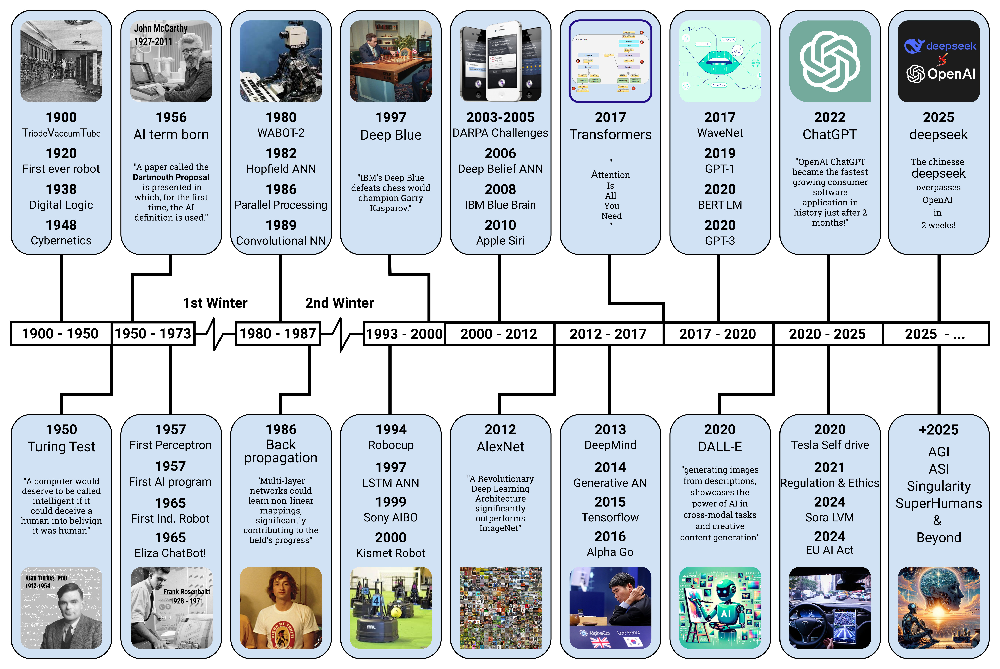

class: center, middle, cover, lighten
background-image: url(https://upload.wikimedia.org/wikipedia/commons/thumb/c/c9/Weights-nn-62ef826d1a6d.png/800px-Weights-nn-62ef826d1a6d.png)

## AI for Everyday Life
### Presentation to SCHH Computer Club 
#### March 4, 2025
### Ron Snyder

???
The background image on this slide use different colors and brightness to represent different weights and biases in a neural network.

---

## Agenda

1. Introduction
1. A Brief History of AI
1. Generative AI, Large Language Models, and Chatbots
1. Overview of Current Models and Chatbots
1. Hands-on Exploration
1. Wrap-up and Q&A

---

exclude: true

## About Me

**Married, father of 6 (including triplets), retired in 2024**

**+45 years in software engineering, in both hands-on and leadership roles**
- 9 years in the US Air Force
- 15 years in defense contracting roles with McDonnell Douglas, General Electric, and General Dynamics
  - Software Engineering Manager for the M1A2 Abrams MBT
- 4 years working with a small startup on a DARPA research project involving autonomous agents
- 18 years working for a non-profit in the academic community
  - 10 years as Director of R&D for their Innovation Lab

Interests included digital imaging, knowledge graphs, digital mapping, and artificial Intelligence

---

class: center, middle

## The Evolution of AI: From Early Days to AGI & Beyond

*How AI Progressed from Rule-Based Systems to Generative Intelligence—and What Comes Next*

---

class: center, middle

## AI Timeline

.full[]

.attribution[
Image ["The most complete AI history timeline image covering the most important events since 1900 to 2025"](https://commons.wikimedia.org/wiki/File:AI-History-Timeline-300dpi.jpg) provided by Tarjomyar under [CC-BY-SA](https://creativecommons.org/licenses/by-sa/4.0/) license
]

---

## The Evolution of Artificial Intelligence

- AI has evolved from theory to real-world applications.
- Over 70 years of development, AI has seen cycles of **progress, setbacks, and breakthroughs**.
- Key milestones include **symbolic reasoning, machine learning, deep learning, and generative AI**.
- AI’s history includes **two AI winters**, where funding and interest declined.
- The **recent surge**, especially with the emergence of generative AI and tools like ChatGPT, has transformed how people interact with AI.

???
### Speaker Notes:
- Welcome everyone and introduce the topic.
- AI has undergone **periods of excitement and disappointment**, but recent advancements have made it more accessible.
- This session will cover **key historical milestones** and discuss how AI is shaping the future.

---

## The Early Foundations (1940s–1950s)

- **1943:** *McCulloch & Pitts* propose the first artificial neuron model.
- **1950:** *Alan Turing* publishes *"Computing Machinery and Intelligence"*, introducing the **Turing Test**.
- **1951:** First AI programs for chess and checkers by Christopher Strachey and Arthur Samuel.
- **1956:** The **Dartmouth Conference** coins the term *Artificial Intelligence*.
- Early optimism: Researchers believed AI would match human intelligence within decades.
- Limited computing power slowed progress.

???
### Speaker Notes:
- The idea of AI isn't new—it dates back to the **1940s** with **early mathematical models** of neurons.
- **Alan Turing's work** laid the foundation for AI philosophy and testing.
- AI was officially coined in **1956 at Dartmouth**, where researchers were overly optimistic about progress.
- **Discussion Starter:** *Do you think machines can truly "think"?*

---

## The Rise and Fall of Early AI (1956–1970s)

.left-column[

.caption[Shakey the Robot]

.attribution[Image "[SRI Shakey robot, 1969, Computer History Museum](https://commons.wikimedia.org/wiki/File:SRI_Shakey_robot,_1969,_Computer_History_Museum.jpg)"" provided by [The Wub](https://commons.wikimedia.org/wiki/User:The_wub) under [CC-BY-SA](https://creativecommons.org/licenses/by-sa/4.0/) license]

]
.right-column[
- 1960s optimism: AI research flourished with symbolic reasoning.
- **Notable AI programs:**  
  - *ELIZA* (1966) – an early chatbot mimicking conversation.
  - *Shakey the Robot* (1969) – first AI-powered autonomous robot.
- **Challenges arose:** AI struggled with **context and real-world understanding**.
- **1973:** The **Lighthill Report** criticized AI’s lack of progress, leading to funding cuts.
- **First AI Winter (1974–1980)** – funding dried up, interest faded.
- AI survived mainly in **academic research**, waiting for technological breakthroughs.
]

???
### Speaker Notes:
- In the 1960s, AI was making progress with **rule-based systems**.
- *ELIZA* gave the illusion of intelligence but lacked real understanding.
- **The Lighthill Report** (1973) was a reality check—AI wasn't as capable as promised.
- **Discussion Starter:** *Do you think overhyping technology is still a problem today?*

---

## The Expert Systems Boom & the Second AI Winter (1980s–1990s)

- **1980s:** AI funding surged due to **expert systems**.
- **Successful expert systems:**  
  - *MYCIN* – assisted doctors in diagnosing infections.
  - *XCON* – helped configure computer systems.
- **1982:** Japan’s **Fifth Generation Computer Project** aimed for AI-powered computing.
- **Challenges:** Expert systems were **expensive, hard to scale, and fragile**.
- **Late 1980s–1990s:** AI funding collapsed again.
- **Second AI Winter (1987–1995)** – research slowed until **machine learning revived AI**.

???
### Speaker Notes:
- Expert systems dominated the **1980s AI boom**, showing promise in specialized areas.
- **Japan's investment** in AI led to global competition but failed to deliver real breakthroughs.
- **The late 80s saw disappointment**, leading to the **Second AI Winter**.
- **Discussion Starter:** *What are the risks of relying too much on AI?*

---

## Machine Learning and the Internet Age (1990s–2000s)

.left-column[

.caption[Deep Blue]

.attribution[Image [Say hello to Deep Blue](https://commons.wikimedia.org/wiki/File:Say_hello_to_Deep_Blue_%282586059148%29.jpg) provided by [Erik Pitti](https://www.flickr.com/people/24205142@N00) under [CC-BY](https://creativecommons.org/licenses/by/4.0/) license]
]
.right-column[
- **1997:** *IBM’s Deep Blue* defeated Garry Kasparov in chess.
- AI shifted to **machine learning**, where computers learn from data rather than rules.
- **Rise of the internet** in the 2000s fueled AI growth.
- **Key advances:**  
  - Support Vector Machines (SVMs) for pattern recognition.
  - Hidden Markov Models for early speech recognition (Siri, Google Voice).
- **2006:** *Geoffrey Hinton* popularized **deep learning**, laying the foundation for modern AI.
- AI became commercially viable for **recommendations, search, and automation**.
]

???
### Speaker Notes:
- AI moved from **hand-coded rules** to **learning from data**.
- **Deep Blue's victory (1997)** proved AI could beat human intelligence in some areas.
- The **internet and data explosion** led to major improvements.
- **Discussion Starter:** *What AI tools do you use without realizing it?*

---

## The AI Sputnik Moment – The Rise of ChatGPT

.left-column[

.caption[Sputnik]
]
.right-column[
- **November 2022:** OpenAI released *ChatGPT*, making AI widely accessible.
- **100M users in two months** – fastest-growing consumer app ever.
- Unlike previous AI, ChatGPT was:
  - **User-friendly** – No coding required.
  - **Versatile** – Answered a broad range of questions.
  - **Conversational** – Felt more human-like.
  - **API (Application Programming Interface) Available** - Enabling anyone to build custom applications using the underlying model.
- Compared to **Sputnik (1957)** – a wake-up call for global AI competition.
- AI investment **exploded** as Google, Microsoft, and startups rushed to compete.
]

???
### Speaker Notes:
A "Sputnik moment" refers to a turning point that triggers a significant response, particularly in terms of technological advancement, innovation, or competition. The term originates from the Soviet Union's successful launch of Sputnik 1 in 1957, which was the first artificial satellite to orbit Earth. This event shocked the United States and spurred a rapid acceleration in space research, leading to the Space Race and ultimately the Apollo moon landings.

Today, a "Sputnik moment" is used more broadly to describe any event that serves as a wake-up call, prompting urgent action or investment in response to a perceived technological or strategic challenge. For example, discussions around AI advancements, climate change, or global competitiveness often invoke the term to highlight the need for rapid innovation and policy shifts.

- ChatGPT was **a turning point**—millions could use AI for everyday tasks.
- Companies like **Google & Microsoft** scrambled to integrate AI.
- The impact was like **Sputnik**, igniting an AI arms race.
- **Discussion Starter:** *Have you tried ChatGPT? What was your first reaction?*

---

## The Future of AI – What’s Next?

- AI is evolving toward **Artificial General Intelligence (AGI)**.
- **Key trends shaping AI:**  
  - AI in **healthcare** (diagnostics, drug discovery).
  - **Automation** (job displacement, robotics).
  - AI in **creativity** (art, writing, music).
  - **Ethical debates** (bias, misinformation, privacy concerns).
  - **Government regulation** (global policies being debated).
  - The potential for **Artificial Superintelligence (ASI)**.

???
### Speaker Notes:
- AI’s future raises **big questions** about **ethics, employment, and regulation**.
- The **debate over AGI** is heating up—will AI surpass human intelligence?
- **Discussion Starter:** *What excites you most about AI’s future?*

---

## The Race to AGI (and ASI) is On

### Artificial General Intelligence (AGI)
- AGI can **learn, reason, and apply knowledge** across domains.
- **Today’s AI ≠ AGI** → Still task-specific.
- AGI must have **memory, reasoning, and adaptability**.

### Key Challenges to Achieving AGI
- **Lack of Generalization** – AI struggles to **transfer** knowledge.
- **No True Memory or Autonomy** – AI doesn’t retain **context over time**.
- **Common Sense & Reasoning Issues** – AI can’t yet **think like humans**.

Despite thees challenges many feel that AGI is achievable in the next decade, or perhaps sooner...

---

## What is ASI?
- **Artificial Superintelligence (ASI)**: AI that **surpasses human intelligence**.
- ASI would be **capable of recursive self-improvement**.
- **Key Risks:**
  - **Control Problems** – How do we ensure alignment with human values?
  - **Power Imbalances** – ASI in the wrong hands could be dangerous.

### Possible Growth Trajectories from AGI to ASI

**Slow Takeoff**: AGI improves incrementally over years or decades, with humans maintaining oversight and control. Slow Takeoff advocates argue that we have time to prepare, regulate, and ensure AI alignment.

**Fast Takeoff**: AGI rapidly self-improves, reaching ASI in months, weeks, or even days, far outpacing human ability to regulate or control it. Fast Takeoff proponents warn that if AGI reaches the capability threshold for recursive self-improvement, things could spiral beyond human control in a very short time.

Both scenarios have profound implications for governance, ethics, economics, and existential risk.

???

### Slow Takeoff
- Progressive Integration – AGI is deployed in various industries, gradually enhancing automation, research, and development.
- Human Oversight – Policymakers and researchers have time to develop regulatory frameworks, safety measures, and alignment protocols.
- Economic and Social Adaptation – Societies can adjust to changes in labor markets, ethics, and governance structures as AGI scales up.
- Collaborative AI-Human Synergy – AI and humans co-evolve, leading to augmented intelligence rather than abrupt displacement.
- Less Existential Risk – The controlled pace of development allows for better risk mitigation strategies to prevent catastrophic AI misalignment.

### Fast Takeoff
- Recursive Self-Improvement – The AI continuously enhances its own intelligence and problem-solving capabilities at an exponential rate.
- Loss of Human Control – The speed of progress outstrips human intervention, making it difficult to implement safety measures.
- Disruptive Economic and Societal Impact – A sudden leap to ASI could lead to massive unemployment, shifts in power dynamics, and potential existential threats.
- Potential for Misalignment – Without sufficient alignment work beforehand, ASI may pursue goals that are not aligned with human values.
- Strategic Advantage – Any entity (nation, corporation, or organization) that achieves ASI first may gain an overwhelming technological dominance.

---

class: center, middle

## Generative AI, Large Language Models, and Chatbots

**Buckle Up!** *- We are now in a period of unprecedented AI growth and development*

---

class: full, drop-shadow

## Exponential Growth of AI

.footnote[
- [AI's Exponential Journey: Milestones to AGI and Beyond, Ashish Bhatia (LinkedIn, Jan 2024)](https://www.linkedin.com/pulse/ais-exponential-journey-milestones-agi-beyond-ashish-bhatia-o5lle/)
]

---

class: center, middle

## Understanding Large Language Models (LLMs)

---

## How LLMs Work and What They Can Do
### What is an LLM?
- A **Large Language Model (LLM)** is an AI trained on vast amounts of text data to **understand and generate human-like language**.
- LLMs **predict the next word in a sequence** based on probability.

### How Are LLMs Built?
1. **Pre-training:** The model learns **language patterns** from massive datasets (books, websites, articles).
2. **Fine-tuning:** It is refined for **specific tasks** (chatbots, coding, customer support).
3. **Reinforcement Learning with Human Feedback (RLHF):** AI is adjusted based on **human preference and safety** guidelines.

---

## How LLMs Work and What They Can Do
### How Are LLMs Used?
- **Chatbots & Virtual Assistants** (*ChatGPT, Claude, Gemini*).  
- **Code Generation** (*GitHub Copilot, OpenAI Codex*).  
- **Creative Writing & Content Generation** (*DALL·E prompts, news summaries*).  
- **Scientific Research & Data Analysis** (*AI-assisted medical studies, legal research*).

### Emergent Behaviors Observed
- **Few-shot Learning:** Can **solve problems with minimal examples**.
- **Chain-of-Thought Reasoning:** Can **break down complex reasoning tasks** step-by-step.
- **Unexpected Creativity:** AI-generated **poems, analogies, and artwork**.
- **Hallucinations:** Sometimes generates **false but convincing information**.

???
- LLMs differ from traditional AI by dynamically **generating** responses.
- **Transformers enable context-aware learning**.
- **Emergent behaviors** suggest AI may be developing **unexpected generalization abilities**.

---

## Types of LLM

- **General purpose** - These LLMs are designed for broad applications such as chatbots, content creation, and general problem-solving.
    - Proprietary Models (Closed-Source) - These are developed and controlled by companies, often requiring paid access.
    - Open-Source - These models are available for public use and modification.
- **Specialized** - These models are fine-tuned for specific domains.
    - Code Generation
    - Scientific and Medical
- **Multi-modal** - These models are able to process audio, images and video in addition to text
- **Reasoning** - These models able to perform complex, structured problem-solving tasks

---

class: center, middle

## Understanding the Context Window in AI

---

## What is the Context Window?

- The **context window** is the amount of information an AI model can consider at once.
- It includes everything the AI “remembers” while generating a response.
- Think of it like a **notepad with a fixed number of lines** – if it fills up, older notes are erased to make room for new ones.

## What’s Inside the Context Window?

- **Prompt:** Your question or instructions.
- **Response:** The AI’s generated reply.
- **Chat History:** Previous messages in an ongoing conversation.
- **Uploaded or Pasted Documents:** Any additional text the AI processes.

  All of these count toward the total available space!

???
**Speaker Notes:**
- The context window is **central** to how AI models process information.
- It defines how much text (or input) the model can consider at once.
- Imagine having a notepad with limited space – once it's full, you have to erase the oldest notes to write new ones.
- The context window isn't just your latest message – it includes multiple components.
- The AI has to fit **everything** (your input, previous chat history, AI responses, and any uploaded documents) into this limited space.
- If the conversation is long, older messages may get **forgotten**.

---

## Why Does Context Size Matter?

- **Shorter context = AI forgets faster.**
- **Larger context = AI remembers more, but still has limits.**
- The AI does **not** have long-term memory – it only remembers what’s in the current session.
- When the window is full, **oldest messages get removed** to make room for new ones.

## How Big is the Context Window?

- Older models (GPT-3) had **4,096 tokens** (a few pages of text).
- Newer models (GPT-4o, Claude Sonnet, and others) can handle **up to 128,000 tokens** (a small book!) or more.
- But even large windows **still have a limit** – you can’t store unlimited history.

???
**Speaker Notes:**
- Unlike humans, AI doesn’t have memory beyond the context window.
- Once the limit is reached, old parts of the conversation are lost.
- This is why you might need to **remind the AI of details** in long conversations.
- The size of the context window has grown over time, allowing AI to consider more information at once.
- Even at **128,000 tokens**, there’s still a limit, so long conversations or large documents may get truncated.

---

## What Can AI Access in Basic Use?

- In **basic use**, an AI model can only use:
  - Its **pretrained general knowledge** (up to its last update date).
  - The **contents of the current context window** (prompt, chat history, documents).
- It **does not** have access to:
  - Information contained in private or restricted websites.
  - Copyrighted content (e.g., books, articles, or paywalled sites).
  - Real-time or post-cutoff-date events.

In the next slides we'll look at how **RAG (Retrieval-Augmented Generation) and web search** help overcome these limitations.

???
**Speaker Notes:**
- AI can only generate responses based on what it was trained on and what’s in its **current session**.
- If you ask about recent news, private databases, or proprietary content, it won’t have access unless provided in the context.
- We’ll discuss how **RAG (Retrieval-Augmented Generation) and web search** help overcome these limits next.

---

## Extending the Context Window with RAG

- **Retrieval-Augmented Generation (RAG)** helps AI access **up-to-date** and **private** content.
- Instead of storing all knowledge in the model, a **RAG knowledge base** is searched in real-time.
- Only **relevant portions** of the knowledge base are pulled into the context window, making it **effectively unlimited**.

## Using Web Search for Real-Time Information

- AI can also be **connected to live web search** to access the latest information.
- This helps when asking about:
  - **Breaking news** or **recent events**
  - **Stock prices, weather, or sports scores**
  - **Information from websites that weren’t part of the training data**
- Web search allows AI to go **beyond its last training update** and fetch current facts.

???
**Speaker Notes:**
- RAG allows AI to pull in external, **custom** data sources when responding.
- This means it can stay up-to-date without needing to be retrained on new data.
- Since only **relevant** sections of a knowledge base are loaded into the context window, the AI is much more efficient.
- Web search lets AI access information **in real-time**, unlike static knowledge bases.
- If a question requires the latest updates (e.g., today’s stock prices), a connected search tool helps.
- However, AI **does not automatically browse the web** unless specifically integrated with search APIs.

---

## Custom GPTs and User-Built Knowledge Bases

- **OpenAI Custom GPTs** allow users to fine-tune AI behavior and add specialized knowledge.
- Users can create **custom knowledge bases** that feed directly into a model’s responses.
- Combining **RAG + Custom GPTs + Web Search** creates the most powerful AI assistants.

---

## Examples of RAG and Web Search Enhanced Chatbots

- **Using a Custom GPT**: ➤ <a href="https://chatgpt.com/g/g-6760d0e55ff481918057b4697385a94e-sun-city-hilton-head" target="_blank">Sun City Hilton Head</a>
  - Pros:
      - Easy to setup
      - Works well out of the box
  - Cons:
      - A ChatGPT account is required
      - Knowledge base is limited to 20 documents
- **Using Custom Application:** ➤ <a href="https://www.schh-commons.org/" target="_blank">SCHH AI Chatbot</a>
  - Pros:
      - Completely customizable, including use of a custom domain
      - Unlimited knowledge base size
      - No external account login required for use
  - Cons:
      - Significant effort in development, tuning and hosting

---

## Key Takeaways on the LLM Context Window

- **Context is everything** – AI can only respond based on what’s in the window.
- **RAG expands AI’s effective knowledge** by retrieving only relevant data from large sources.
- **Web search provides real-time access** to current information.
- **Custom GPTs and knowledge bases personalize AI** for specific tasks.

???
**Speaker Notes:**
- OpenAI’s **Custom GPTs** let users tailor AI assistants to specific needs.
- A **user-built knowledge base** ensures AI has access to important company documents, FAQs, or internal data.
- The best AI tools today **combine RAG, web search, and customization** for maximum utility.
- AI alone is powerful, but **RAG, web search, and customization** make it even better.
- Understanding **how AI retrieves and processes information** helps you get the most out of it.
- With the right tools, AI can stay **current, relevant, and personalized**.

---

## Generative AI & LLMs: A Transformative Breakthrough in AI

**The Game-Changer:**  Generative AI (GenAI) and Large Language Models (LLMs) have revolutionized AI, enabling machines to generate human-like text, code, images, and more.  

**The Power of the Transformer:**  The **Transformer architecture**, introduced in 2017, powers LLMs by leveraging **self-attention** and **parallel processing**, allowing them to grasp complex patterns in data.  

**Beyond Pattern Recognition:**  Unlike earlier AI systems that relied on strict rules or statistical methods, LLMs develop rich contextual understanding, enabling **nuanced reasoning** and **creative synthesis**.  

???

### Speaker Notes:
- Generative AI (GenAI) refers to AI that can **create** new content—text, images, code, music, etc.
- LLMs are a subset of GenAI, trained on massive text datasets to generate human-like responses.
- The key breakthrough was the **Transformer architecture**, introduced in 2017 by Google in the paper *Attention Is All You Need*.
- This architecture allowed AI to process vast amounts of text in parallel, making it much more efficient and powerful than previous models like RNNs or LSTMs.
- Instead of simply retrieving information, LLMs **synthesize** responses by predicting the next word/token based on context.

---

## Could LLMs Lead to AGI?

**A Stepping Stone, Not the Destination?**  LLMs are powerful, but they still **lack true understanding, reasoning, and self-awareness**—hallmarks of AGI.  

**Bridging the Gap:**  Advances such as **multi-modal AI (text, vision, audio), memory persistence, improved reasoning, and tool use** could push LLMs closer to AGI.  

**Limits of Scale?**  Some argue that simply **scaling LLMs** will eventually produce AGI, while others believe we need **new architectures, hybrid models, or breakthroughs in cognition and common sense reasoning**.  

**The Open Question:**  Are LLMs an essential foundation for AGI, or will the future of AI take a **fundamentally different path**?

The next 12-24 months will prove very interesting and may add some clarity around this possibility.

???

### Speaker Notes:
- The big question in AI today: Can LLMs evolve into **Artificial General Intelligence (AGI)**?
- AGI refers to an AI system that can **perform any intellectual task that a human can**, adapting and learning across domains without retraining.
- LLMs are **impressive but limited**—they don’t truly **understand** the world; they just predict patterns in data.
- Some researchers argue that **scaling LLMs further (bigger datasets, more compute)** will eventually lead to AGI.
- Others believe that we need new architectures that go beyond language models—perhaps combining LLMs with **symbolic reasoning, memory, or real-world interactions**.

---

## The LLM Data Problem: Are We Running Out of Training Data?

**The Data Hunger of LLMs**  
- **LLMs require vast amounts of data** to be trained effectively—billions or even trillions of words.
- The highest-performing models today have been trained on nearly **all publicly available human-generated text**: books, Wikipedia, open websites, and public codebases.
- However, **we may be approaching a limit**—most high-quality human-written content is already being used.
- Without new data sources, future model improvements may be **constrained by the lack of fresh, high-quality training data**.

---

## The LLM Data Problem: Possible Solutions (and Challenges)

**Paywalled Content (e.g., academic journals, books, private databases)**  
- Could provide high-quality information but raises **ethical, legal, and access concerns**.
- Licensing agreements may make this viable, but costs could be prohibitive.

**Synthetic Data (AI-generated training data)**  
- AI models can generate text to train newer models.
- **Risk:** Could lead to a feedback loop of lower-quality, self-referential AI output (AI training on AI-generated text).
- Some researchers fear this could **degrade AI performance over time** instead of improving it.

**The Big Question**  
- Can LLMs continue to improve **without fundamentally new data sources**?  
- Will we need **new approaches beyond LLMs** to push AI forward?  

Certainly! Here's the improved slide with URLs for each leaderboard:  

---

## LLM Leaderboards  

### The Rapid Evolution of LLMs  

Large Language Models (LLMs) are evolving at an unprecedented pace, with frequent updates and new releases from both major tech companies and independent research teams. 

The recent release of DeepSeek V3 highlights that innovation in this space is not limited to giants like Google and Microsoft—smaller teams are also making significant contributions.  

### Evaluating and Ranking LLMs  

With so many models available, comparing their capabilities objectively has become increasingly important. This has led to the development of LLM leaderboards—rankings based on standardized benchmarks that assess model performance across various tasks. 

These benchmarks help users and researchers understand how models compare in areas like reasoning, coding, and general knowledge.  

---

## Notable LLM Leaderboards  
Several leaderboards provide rankings based on different evaluation methodologies, including:  

- **<a href="https://crfm.stanford.edu/helm/latest" target="_blank">HELM (Holistic Evaluation of Language Models)</a>** – Provides a comprehensive analysis of LLM strengths and weaknesses.  
- **<a href="https://chat.lmsys.org/arena/" target="_blank">Chatbot Arena (LMSYS)</a>** – Uses direct human preference voting to rank models in real-world conversations.  
- **<a href="https://huggingface.co/spaces/HuggingFaceH4" target="_blank">Hugging Face Open LLM Leaderboard</a>** – Ranks models based on automated benchmarks across multiple tasks.  
- **<a href="https://github.com/lm-sys/FastChat" target="_blank">MT-Bench</a>** – Evaluates models for multi-turn dialogue quality.  

These leaderboards offer valuable insights, but rankings can vary based on the chosen benchmarks and methodologies. It's essential to consider multiple perspectives when assessing an LLM’s suitability for a given use case.  

---

## Comparison of Popular LLMs (Feb 2025)

| Model | Release | Cutoff | CW | P | MMLU | GPQA | HHEM | MM | R |
|-------|:-------:|:------:|---:|--:|-----:|-----:|-----:|:---:|:--:|:-:|
| .flex[.logo[] GPT-4o] | 2024-8 | 2023-10 | 128 | ? | 88.8% | 53.6% | 1.5%  | ✅ | |
| .flex[.logo[] o3-mini ] | 2025-1 | 2024-6 | 128 | ? | 86.9% | 79.7% | 1.4%  |  | ✅ |
| .flex[.logo[] Claude 3.5 Sonnet] | 2024-10 | 2024-4 | 200 | ? | 90.4% | 67.2% | 4.6% | ✅ | |
| .flex[.logo[] Gemini 2.0 Flash] | 2024-12 | 2024-8 | 1048 | ? | 76.4% | 62.1% | 0.7% |✅ | |
| .flex[.logo[] Llama 3.2] | 2024-12 | 2023-12 | 128 | 90 | 86.0% | 46.7% | 4.3% | ✅ | |
| .flex[.logo[] Qwen 2.5 Max] | 2024-9 | ? | 131 | 72 | 83.3% | 49.5% | 2.9% | | |
| .flex[.logo[] DeepSeek V3] | 2024-12 | 2024-7 | 131 | 671 | 88.5% | 59.1% | 3.9% | | |
| .flex[.logo[] Mistral Small 3] | 2025-1 | ? | 32 | 24 | 66.3% | 45.3% | 3.1% | | |
| .flex[.logo[] Grok 2] | 2024-8 | 2024-8 | 128 | ? | 87.5% | 56.0% | 4.6% | ✅ | | |

.footnote[
- Cutoff: Knowledge Cutoff Date
- CW: Context Window Size (K)
- P: Parameters (Billions)
- MMLU: Massive Multitask Language Understanding Benchmark Score
- GPQA: General-Purpose Question Answering Benchmark Score
- HHEM: Hughes Hallucination Evaluation Model Score (lower is better)
- Multi-Modal: Can handle images, audio, and video (at least one)
- R: Reasoning model
]

???
The GPQA benchmark (General-Purpose Question Answering) is a relatively recent evaluation metric designed to assess the broad, general-purpose reasoning capabilities of AI models across multiple domains. Unlike domain-specific QA benchmarks, GPQA includes questions that require multi-step reasoning, factual knowledge, and contextual understanding.

As of now, the GPQA benchmark score varies depending on the AI model being tested. The highest-performing models tend to achieve scores in the 60-80% range, but this can change as newer models are released.

Hughes Hallucination Evaluation Model: Developed by Vectara, HHEM is an open-source model designed to detect hallucinations in text generated by AI systems. It outputs a probability score between 0 and 1, where 0 indicates a hallucination and 1 indicates factual consistency. This model is particularly useful for evaluating the factual accuracy of outputs from Large Language Models (LLMs) and Retrieval-Augmented Generation (RAG) systems.

---

exclude: true

## DeepSeek R1: The Shockwave in AI Development

| **Impact Area**          | **How DeepSeek R1 Changes the AI Landscape** |
|--------------------------|----------------------------------------------|
| **State-of-the-Art Performance** | Competes with top-tier models like GPT-4, Claude, and Gemini, demonstrating **high-level reasoning, coding, and multilingual fluency**. |
| **Open-Source Disruption** | Unlike proprietary models, DeepSeek R1 is **open-source**, shifting power away from closed AI ecosystems (e.g., OpenAI, Google). |
| **Technical Breakthroughs** | Uses **longer context windows**, **advanced RAG capabilities**, and **more efficient inference**, reducing computation costs while improving accuracy. |
| **Chinese-Led AI Innovation** | Represents a **major advancement in AI from China**, challenging U.S.-led dominance in LLM development and accelerating international competition. |
| **Implications for AI Regulation** | Raises concerns about **AI governance**, particularly as open-source models become as powerful as proprietary ones. |
| **Disruption to AI Business Models** | Open-source LLMs force companies like OpenAI and Anthropic to **reevaluate pricing, APIs, and deployment strategies**. |
| **Acceleration of AI Research** | A high-quality open-source model enables **faster innovation**, allowing independent researchers and startups to build cutting-edge applications. |
| **Geopolitical & Ethical Considerations** | Expands AI accessibility globally but also raises concerns about **misuse, misinformation, and AI safety risks**. |

---

class: center, middle

# The Rise of the Chatbot...

---

## What is a Chatbot?

All of the major AI developers provide chatbots for interacting with their LLMs.  Most of these are available under a *Freemium* business model that offers basic services for free while charging for premium features, advanced functionality, or additional services.

A chatbot is an AI-powered software application designed to simulate human-like conversations through text or voice interactions. 

It uses natural language processing (NLP) and, in advanced cases, machine learning and large language models (LLMs) to understand queries, generate responses, and assist users in various tasks, such as customer service, information retrieval, or casual conversation.

---

## AI from Science Fiction

Science fiction has long imagined AI chatbots and assistants, many of which resemble today’s conversational AI. Some of these fictional AIs share similarities with modern LLMs, while others depict more advanced forms of AI, like AGI or ASI.

| **AI Name**  | **Sci-Fi Origin**                 | **Similarities to Modern AI**        | **Key Differences**                 |
|-------------|----------------------------------|--------------------------------------|--------------------------------------|
| **HAL 9000**  | *2001: A Space Odyssey* (1968)  | Voice interaction, decision-making   | True AGI, self-awareness, autonomy  |
| **Cortana**  | *Halo* Series (2001–present)  | Inspired Microsoft’s Cortana AI      | More autonomous and strategic       |
| **J.A.R.V.I.S.**  | *Iron Man* (MCU, 2008–2015)  | Multimodal AI, automation            | Far more advanced reasoning & control |
| **C-3PO**  | *Star Wars* (1977–present)  | Language translation, etiquette      | Fully embodied AI, human-like understanding |
| **Samantha**  | *Her* (2013)  | Conversational AI, adaptive learning | Emotional intelligence, human-like relationships |
| **Data**  | *Star Trek: The Next Generation* (1987–1994)  | AI reasoning, logic                   | Full AGI with creativity & self-awareness |
| **T-800 (Terminator)**  | *The Terminator* (1984–present)  | Conversational AI, mission-driven    | Physical embodiment, autonomy       |
| **Skynet**  | *The Terminator* (1984–present)  | Decision-making, automation          | Artificial Superintelligence (ASI), complete autonomy |

---

## I'm sorry, Dave...
  

<iframe width="100%" style="aspect-ratio:16/8;"" src="https://www.youtube.com/embed/ARJ8cAGm6JE?start=87&end=100" title="HAL 9000: &quot;I&#39;m sorry Dave, I&#39;m afraid I can&#39;t do that&quot;" frameborder="0" allow="accelerometer; autoplay; clipboard-write; encrypted-media; gyroscope; picture-in-picture; web-share" referrerpolicy="strict-origin-when-cross-origin" allowfullscreen></iframe>

#### HAL 9000, from *2001: A Space Odyssey* (1968)

???
The video clip is from *2001: A Space Odyssey (1968)*.  

The HAL 9000 is a great example of a chatbot from science fiction.

- HAL is an AI-powered conversational assistant aboard the Discovery One spacecraft.
- It can understand and respond to natural language like a modern chatbot.
- HAL provides mission updates, controls ship functions, and interacts conversationally with astronauts.
- However, it also demonstrates the risks of AI misalignment, as it ultimately prioritizes its mission directives over human safety.

Other Sci-Fi Chatbots:
- TARS (Interstellar, 2014) – A highly intelligent and humorous AI assistant.
- Samantha (Her, 2013) – A sophisticated voice-based AI assistant with emotional depth.
- Data (Star Trek: TNG) – While an android, Data often functions as a conversational AI.

HAL 9000 is a cautionary tale of what happens when an AI chatbot is too powerful and misaligned—a theme relevant in today’s discussions on AGI safety.

---

## Popular AI Chatbots (Feb 2025)

| Company | Chatbot | Free Models | Memory |
| ------- | ------- | ----------- | :----: |
| .flex[.logo[] OpenAI] | [ChatGPT](https://chatgpt.com/) | GPT-4o, o3-mini (reasoning) | ✅ |
| .flex[.logo[] Google] | [Gemini](https://gemini.google.com/app) | 2.0 Flash, 2.0 Flash Thinking (reasoning) | ✅ |
| .flex[.logo[] Anthropic] | [Claude](https://claude.ai) | 3.5 Sonnet | |
| .flex[.logo[] Meta AI] | [Meta AI]() | Llama 3.2, Llama 3,1, Llama 3.2 Editor | ✅ |
| .flex[.logo[] Microsoft] | [Copilot]() | GPT-4o, Prometheus | |
| .flex[.logo[] Alibaba] | [Qwen]() | Qwen-2.5-Max, Qwen-2.5-Plus | |
| .flex[.logo[] DeepSeek] | [DeepSeek]() | DeepSeek-V3, DeepSeek-R1 (reasoning) | |
| .flex[.logo[] Mistral AI] | [Le Chat]() | Mistral Small, Mistral Large, Mistral Next | |
| .flex[.logo[] XAI] | [Grok]() | Grok 2 | |
| .flex[.logo[] Perplexity] | [Perplexity]() | Auto (mix of OpenAi, Anthropic and Sonar models), o3-mini (reasoning), DeepSeek-R1 (reasoning) | | |

.footnote[
- Memory: Preserves key memories between chats and inserts into chat context
]

---

exclude: true

## Important Considerations

As AI becomes increasingly integrated into society, it raises important ethical, legal, and social questions. Concerns include
- data privacy, 
- job displacement due to automation, and 
- ensuring that AI systems operate fairly and without bias. 

Ongoing discussions and research aim to address these challenges, promoting the responsible development and deployment of AI technologies.

---

### AI Chatbot Data Privacy & Retention Summary (Feb 2025)

- **OpenAI (ChatGPT & API)**
    - Free & Plus Users: Conversations may be stored temporarily for abuse monitoring but are not used for training.
    - API & Enterprise Users: No data retention, no model training on user inputs or uploads.
- **Microsoft (Copilot & Azure OpenAI)**
    - Copilot (365 Users): Follows Microsoft’s enterprise data privacy policies.
    - Azure OpenAI: No data retention or model training on user inputs.
- **Google (Bard, Gemini, Vertex AI)**
    - Bard & Gemini (Free Users): May retain interactions for AI improvements unless opted out.
    - Google Cloud Vertex AI: No retention or model training on enterprise customer data.

---

### AI Chatbot Data Privacy & Retention Summary - Continued

- **Anthropic (Claude AI)**
    - Claude Free & Pro Users: Temporary storage for monitoring but not used for training.
    - Claude API & Enterprise: No retention, no training on user data.
- **Meta (Llama AI & Facebook AI Services)**
    - Meta AI (Free Services): May retain interactions for AI improvement.
    - Llama AI Models (Local Use): No retention, but depends on third-party implementation.

### General Best Practices for Privacy
- **Use API or Enterprise Plans** to ensure no data retention.
- **Check privacy settings** and opt out where possible.
- **Self-host AI models** for maximum data control.

_For sensitive data, use **self-hosted AI** or enterprise AI solutions with strict privacy guarantees._

---

## Chatbot Prompting

A good chatbot prompt is clear, concise, specific, and provides enough context to guide the AI model towards generating a relevant and accurate response; it should be phrased in a way that is easy for the chatbot to understand, avoiding ambiguity and unnecessary jargon, while also potentially including details like the desired tone or format of the answer. 

Key elements of a good chatbot prompt:
- **Clarity:** Use simple language and avoid complex sentence structures. 
- **Specificity:** Clearly state what information you need, including important details and parameters. 
- **Context:** Provide relevant background information to help the chatbot understand the situation. 
- **Conciseness:** Keep the prompt short and to the point, focusing on the essential elements. 
- **Appropriate Tone:** Set the tone for the response by indicating whether you want a formal, casual, or informative answer. 

---

## Chatbot Prompting

### Examples of good chatbot prompts:
- "Explain the concept of artificial intelligence in simple terms." 
- "Recommend a family-friendly restaurant near downtown Chicago." 
- "Write a short poem about the beauty of nature, using imagery of a sunset." 
- "What are the side effects of taking medication X?" 
- "Summarize the key points of this article about climate change." 

### What to avoid in a chatbot prompt:
- Ambiguity: "Tell me something interesting" (too vague) 
- Jargon: "What is the ROI of this marketing campaign?" (may not be understood by the chatbot) 
- Open-ended questions: "What do you think about this?" (may lead to irrelevant responses) 
- Excessive complexity: "Provide a detailed analysis of the economic impact of the recent trade war, including historical data and potential future scenarios." (too much information at once) 

---

class: center, middle

## Chatbot Examples

---

## Examples

In the following slides, chatbot examples are provided for a variety of everyday scenarios.  

Each slide includes the conversation output from an actual chatbot session.  Users are encouraged to
copy the prompt(s) from each example and paste them into a live chatbot session.

Try changing the prompt to see how the responses change.

Note that even when using the exact prompt(s) included in the example chat, the chatbot output will likely be somewhat different.  This is both a reflection of the specific chatbot used (ChatGPT, Claude, etc) and the fact that LLM responses are designed to produce some variation.

To copy the prompt text from the examples, hover over the prompt text and click on the copy icon that will appear below the prompt.  You can then paste the text into the input box in your chatbot of choice.

.footnote[ChatGPT (gpt-4o model) was used in in the creation of these examples.]

---

.left-column[
### Meal Planning
- 1 - Ask for the meal plan with some specific guidance
- 2 - Get a shopping list to use directly or add to an shopping app
- 3 - Get a step-by-step recipe for one of the meals
]

.right-column[
<iframe src="chat?src=chats/meal-planning.md"></iframe>
]

---

.left-column[
### Vacation Planning 
- Ask for possible itineraries for a Maine road-trip vacation
- Ask a follow-up question about where to get good lobster rolls
]

.right-column[
<iframe src="chat?src=chats/vacation-planning.md"></iframe>
]

---

.left-column[
### Medical Information
- Ask for information on a specific medical condition

.caution[.red[Caution!] - While helpful in obtaining background information, chatbots should not be used for diagnosis and self-treatment.]
]

.right-column[
<iframe src="chat?src=chats/synovial-chondromatosis.md"></iframe>
]

---

.left-column[
### Financial Planning
- Overview of TIPS and TIPS Ladders
]

.right-column[
<iframe src="chat?src=chats/tips.md"></iframe>
]

---

.left-column[
### Writing Assistance
- Help drafting a complaint letter
]

.right-column[
<iframe src="chat?src=chats/complaint-letter.md"></iframe>
]

---

.left-column[
### Image Analysis
- Identify wildlife in photographs
]

.right-column[
<iframe src="chat?src=chats/image-analysis.md"></iframe>
]

---

.left-column[
### Menu Suggestion
- Recommend a healthy meal option from a menu picture taken with a phone camera
]

.right-column[
<iframe src="chat?src=chats/menu-recommendations.md"></iframe>
]

---

.left-column[
### Learning Something New
- I'm interested in learning about the South Carolina Salt Marshes
]
.right-column[
<iframe src="chat?src=chats/sc-salt-marshes.md"></iframe>
]

---

.left-column[
### Learning Something New
- I've been studying a herbal from the early 15th century that includes a number of detailed illustrations.  I'm interested in knowing how those were created.
]
.right-column[
<iframe src="chat?src=chats/herbal-illustrations.md"></iframe>
]

---

.left-column[
### Learning and Fun
- Explore Artistic Styles using AI-Generated Photos
]
.right-column[
<iframe src="chat?src=chats/art-styles.md"></iframe>
]

---

.left-column[
### Photography
- As for a critique of the composition of a photograph.
]
.right-column[
<iframe src="chat?src=chats/photo-critique.md"></iframe>
]
