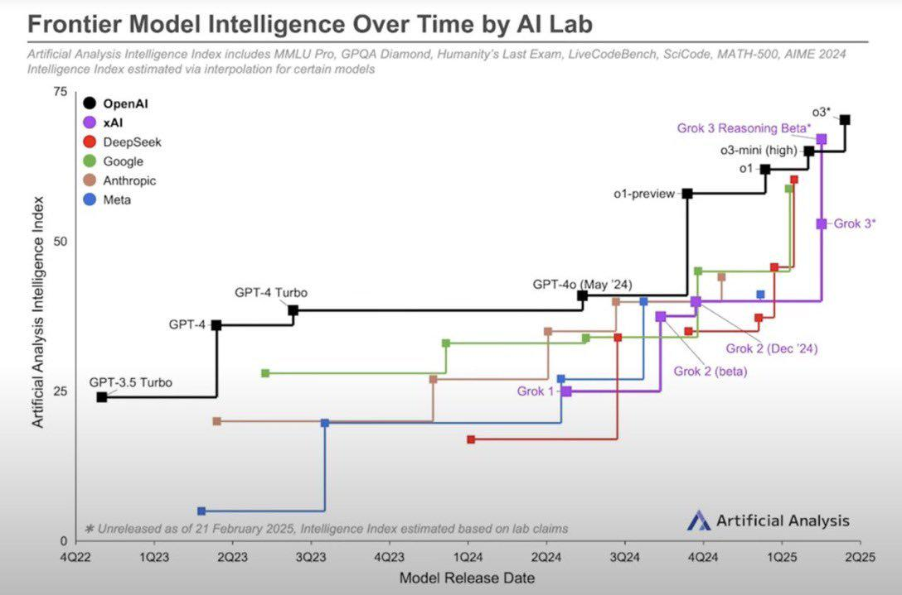

class: center, middle, cover, lighten
background-image: url(https://upload.wikimedia.org/wikipedia/commons/thumb/c/c9/Weights-nn-62ef826d1a6d.png/800px-Weights-nn-62ef826d1a6d.png)

## AI for Everyday Life
### Presentation to SCHH Computer Club 
#### March 4, 2025
### Ron Snyder

???
The background image on this slide use different colors and brightness to represent different weights and biases in a neural network.

---

## Agenda

1. Introduction
1. The Evolution of AI: From Early Days to AGI & Beyond
1. AI Today - Generative AI
  - Large Language Models
  - Chatbots
1. Hands-on Exploration
1. Wrap-up and Q&A

---

exclude: false

## About Me

**Married, father of 6 (including triplets), retired in 2024**

**+45 years in software engineering, in both hands-on and leadership roles**
- 9 years in the US Air Force
- 15 years in defense contracting roles with McDonnell Douglas, General Electric, and General Dynamics
  - Software Engineering Manager for the M1A2 Abrams MBT
- 4 years working with a small startup on a DARPA research project involving autonomous agents
- 18 years working for a non-profit in the academic community
  - 10 years as Director of R&D for their Innovation Lab

Interests included digital imaging, knowledge graphs, digital mapping, and artificial Intelligence

---

class: center, middle

## The Evolution of AI: From Early Days to AGI & Beyond

*How AI Progressed from Rule-Based Systems to Generative Intelligence—and What Comes Next*

---

## The Evolution of Artificial Intelligence

- AI has evolved from theory to real-world applications.
- Over 70 years of development, AI has seen cycles of **progress, setbacks, and breakthroughs**.
- Key milestones include **symbolic reasoning, machine learning, deep learning, and generative AI**.
- AI’s history includes **two AI winters**, where funding and interest declined.
- The **recent surge**, especially with the emergence of generative AI and tools like ChatGPT, has transformed how people interact with AI.

???
### Speaker Notes:
- Welcome everyone and introduce the topic.
- AI has undergone **periods of excitement and disappointment**, but recent advancements have made it more accessible.
- This session will cover **key historical milestones** and discuss how AI is shaping the future.

---

class: center, middle

## AI Timeline

.full[]

.attribution[
Image ["The most complete AI history timeline image covering the most important events since 1900 to 2025"](https://commons.wikimedia.org/wiki/File:AI-History-Timeline-300dpi.jpg) provided by Tarjomyar under [CC-BY-SA](https://creativecommons.org/licenses/by-sa/4.0/) license
]

???

### 1. The Early Foundations of AI (1900-1950)
- **Triode Vacuum Tube (1900)**: Enabled the development of electronic circuits.
- **First Robot (1920)**: Concept of autonomous machines was introduced.
- **Digital Logic & Cybernetics (1938-1948)**: Laid the foundation for computational thinking and feedback loops in machines.
- **Turing Test (1950)**: Proposed by Alan Turing to define machine intelligence—if a computer can convince a human it is also human, it is considered "intelligent."

### 2. The Birth of AI & Initial Progress (1950-1980)
- **Dartmouth Proposal (1956)**: John McCarthy formally introduced the term **Artificial Intelligence**, marking AI’s official birth as a field.
- **First AI Programs & Eliza Chatbot (1957-1965)**: Early steps toward AI-driven human-computer interaction.
- **Perceptron (1957)**: The first artificial neural network, an early step toward machine learning.
- **Backpropagation (1986)**: A major breakthrough in training deep neural networks.

### 3. The AI Winters (1970s & 1980s)
- **First AI Winter (1973-1980s)**: Lack of computing power and funding slowed AI research.
- **Second AI Winter (1987-1993)**: Overhyped expectations led to disappointment and reduced investment.

### 4. The Revival of AI & Machine Learning (1990s-2010s)
- **Deep Blue Defeats Kasparov (1997)**: IBM’s chess-playing AI marked a milestone in AI’s ability to beat human experts.
- **DARPA Challenges (2003-2005)**: Stimulated research in AI and robotics, leading to advances in autonomous systems.
- **Apple Siri (2010)**: AI became mainstream with the introduction of virtual assistants.
- **AlexNet & Deep Learning (2012)**: Deep learning revolutionized AI with a major breakthrough in image recognition.
- **DeepMind & AlphaGo (2013-2016)**: AI defeated human players in Go, a game previously thought too complex for machines.

### 5. The Transformer Revolution & Generative AI (2017-Present)
- **Transformers (2017)**: "Attention Is All You Need" introduced the transformer architecture, powering models like GPT, BERT, and DALL·E.
- **GPT Models (2019-2020)**: AI became capable of generating human-like text, leading to the rise of ChatGPT.
- **DALL·E (2020)**: AI-generated images from text descriptions showcased the power of multimodal AI.
- **ChatGPT (2022)**: Became the fastest-growing consumer app in history, revolutionizing AI accessibility.

### 6. The Future of AI (2025 & Beyond)
- **DeepSeek AI (2025)**: The Chinese AI company surpasses OpenAI in just two weeks, highlighting the global AI competition.
- **AGI & Superhuman AI (Beyond 2025)**: The potential for Artificial General Intelligence (AGI) and AI surpassing human intelligence.
- **Ethical Concerns & AI Regulations (2021-2024)**: Increasing focus on responsible AI, with regulations like the **EU AI Act (2024)**.
- **Tesla Self-Driving AI (2020)**: Real-world applications of AI in autonomous driving.

### Key Themes
- **From Early Research to Real-World Impact**: AI has moved from theoretical concepts to real-world applications.  
- **Breakthrough Technologies**: Neural networks, deep learning, and transformers revolutionized AI.  
- **The Rise of Generative AI**: Models like ChatGPT and DALL·E are changing how we interact with technology.  
- **Challenges & Ethical Concerns**: Regulation, bias, and AI safety remain critical issues.  
- **The Race for AGI**: Future advancements may lead to superhuman intelligence, raising opportunities and risks.

---

background-image: url(https://upload.wikimedia.org/wikipedia/commons/2/22/Sputnik-516.jpg)
class: cover, lighten

## AI's "Sputnik Moment"
### The Rise of ChatGPT

- **November 2022:** OpenAI released *ChatGPT*, making AI widely accessible.
- **100M users in two months** – fastest-growing consumer app ever.
- Unlike previous AI, ChatGPT was:
  - **User-friendly** – No coding required.
  - **Versatile** – Answered a broad range of questions.
  - **Conversational** – Felt more human-like.
  - **API (Application Programming Interface) Available** - Enabling anyone to build custom applications using the underlying model.
- Compared to **Sputnik (1957)** – a wake-up call for global AI competition.
- AI investment **exploded** as Google, Microsoft, and startups rushed to compete.

???

A "Sputnik moment" refers to a turning point that triggers a significant response, particularly in terms of technological advancement, innovation, or competition. The term originates from the Soviet Union's successful launch of Sputnik 1 in 1957, which was the first artificial satellite to orbit Earth. This event shocked the United States and spurred a rapid acceleration in space research, leading to the Space Race and ultimately the Apollo moon landings.

Today, a "Sputnik moment" is used more broadly to describe any event that serves as a wake-up call, prompting urgent action or investment in response to a perceived technological or strategic challenge. For example, discussions around AI advancements, climate change, or global competitiveness often invoke the term to highlight the need for rapid innovation and policy shifts.

- ChatGPT was **a turning point**—millions could use AI for everyday tasks.
- Companies like **Google & Microsoft** scrambled to integrate AI.
- The impact was like **Sputnik**, igniting an AI arms race.
- **Discussion Starter:** *Have you tried ChatGPT? What was your first reaction?*

---

### **Leading AI Companies**
1. **OpenAI** – Creator of ChatGPT, DALL·E, and GPT-4, focusing on AGI (Artificial General Intelligence) research and applications.
1. **Google** – Advanced AI research, known for AlphaGo, AlphaFold, and Gemini.
1. **Anthropic** – Focuses on AI safety and responsible AI with its Claude models.
1. **Meta AI (FAIR - Facebook AI Research)** – Develops LLaMA models, generative AI, and AI-powered social media applications.
1. **Microsoft AI** – Collaborates with OpenAI and integrates AI across its products.
1. **xAI (Elon Musk’s AI startup)** – Focuses on AI research with transparency and alternative AI models like Grok.
1. **DeepSeek AI** – A Chinese AI company developing large language models (LLMs) like DeepSeek-V2, competing with OpenAI and Google, and contributing to the open AI ecosystem.
1. **NVIDIA** – Powers AI with its GPUs and develops AI models.
1. **Amazon AI** – Develops AI-driven products like Alexa and AWS machine learning services.
1. **IBM Research (Watson AI)** – Focuses on enterprise AI solutions, quantum computing, and AI ethics.
1. **Apple AI** – Works on on-device AI, Siri, and privacy-preserving AI technologies.

???
Others include:
1. **Cohere** – Develops large language models with an enterprise focus.
1. **Mistral AI** – A European AI startup focused on open-weight language models.
1. **Hugging Face** – Hosts open-source AI models and fosters a strong AI research community.

### **AlphaGo and AlphaFold: Breakthrough AI Systems by DeepMind**

#### **1. AlphaGo (2016)**
- **What it is:** AlphaGo is an artificial intelligence program developed by **DeepMind** that became the first AI to defeat a professional human player in the ancient board game **Go**.
- **Why it’s important:** Go is much more complex than chess due to its vast number of possible moves. Traditional AI approaches struggled with Go, but AlphaGo used **deep reinforcement learning** to develop strategies beyond human intuition.
- **Milestones:**
  - Defeated European Go champion **Fan Hui** (2015).
  - Beat world champion **Lee Sedol (4-1)** (2016).
  - Defeated **Ke Jie**, the world’s top-ranked player at the time (2017).
  - Led to **AlphaZero**, a more general AI system that mastered Go, Chess, and Shogi without prior human data.

#### **2. AlphaFold (2020)**
- **What it is:** AlphaFold is an AI system designed to predict **protein structures** with high accuracy, solving a decades-old biological problem.
- **Why it’s important:** Understanding protein structures is crucial for drug discovery, disease research, and bioengineering. AlphaFold’s predictions can help scientists develop new treatments for diseases.
- **Milestones:**
  - Won the **Critical Assessment of Structure Prediction (CASP14)** competition in 2020, far surpassing other methods.
  - **Released AlphaFold 2 (2021)**, which achieved near-laboratory accuracy for many proteins.
  - **Public dataset:** DeepMind made its protein structure database **freely available**, helping researchers worldwide.

### **Key Differences:**
| AI System  | Purpose | Field | Impact |
|------------|---------|-------|--------|
| **AlphaGo**  | Mastering Go through AI | Games | Demonstrated AI's ability to surpass human strategy |
| **AlphaFold** | Predicting protein structures | Biology | Revolutionized drug discovery and medical research |

---

### **Top AI Research Institutions & Labs**
1. **Stanford AI Lab (SAIL)** – Research in deep learning, reinforcement learning, and AI ethics.
1. **MIT-IBM Watson AI Lab** – Collaboration between MIT and IBM for AI research.
1. **Carnegie Mellon University (CMU AI)** – Leading in robotics, NLP, and autonomous systems.
1. **UC Berkeley (BAIR - Berkeley Artificial Intelligence Research)** – Research in reinforcement learning and robotics.
1. **Harvard SEAS AI Research** – Focus on AI applications in science and society.
1. **Oxford AI Research** – Works on AI safety and ethics.
1. **ETH Zurich AI Lab** – Leading European research in AI.
1. **Max Planck Institute for Intelligent Systems** – AI research in Europe, focusing on machine learning and robotics.
1. **Tsinghua University & Peking University AI Labs** – China’s leading AI research groups.
1. **Allen Institute for AI (AI2)** – Conducts AI research with an emphasis on open science.

---

class: full, drop-shadow

## AI Intelligence

.footnote[
- From [Independent analysis of AI models and API providers](https://artificialanalysis.ai/)
]
---

## The Future of AI – What’s Next?

- AI is ~~evolving~~ racing toward **Artificial General Intelligence (AGI)**.
  - Whether AGI (and ASI) are achievable is still a topic of some debate
  - The rate of AI progression towards AGI is also uncertain
      - Optimistic views suggest it could happen in the next 5-10 years
      - It's also possible progress stalls until another breakthrough occurs (perhaps we even experience another AI winter)
- **Key trends shaping AI:**  
  - AI in **healthcare** (diagnostics, drug discovery).
  - **Automation** (job displacement, robotics).
  - AI in **creativity** (art, writing, music).
  - **Ethical debates** (bias, misinformation, privacy concerns).
  - **Government regulation** (global policies being debated).
  - The potential for **Artificial Superintelligence (ASI)**.

???
### Speaker Notes:
- AI’s future raises **big questions** about **ethics, employment, and regulation**.
- The **debate over AGI** is heating up—will AI surpass human intelligence?
- **Discussion Starter:** *What excites you most about AI’s future?*

---

class: full, drop-shadow

## Exponential Growth of AI

.footnote[
- [AI's Exponential Journey: Milestones to AGI and Beyond, Ashish Bhatia (LinkedIn, Jan 2024)](https://www.linkedin.com/pulse/ais-exponential-journey-milestones-agi-beyond-ashish-bhatia-o5lle/)
]

---

## Artificial General Intelligence (AGI)

AGI can **learn, reason, and apply knowledge** across domains.

**Today’s AI ≠ AGI** → Still task-specific.

AGI must have **memory, reasoning, and adaptability**.

### Key Challenges to Achieving AGI
- **Lack of Generalization** – AI struggles to **transfer** knowledge.
- **No True Memory or Autonomy** – AI doesn’t retain **context over time**.
- **Common Sense & Reasoning Issues** – AI can’t yet **think like humans**.

Despite these challenges many feel that AGI is achievable in the next decade, or perhaps sooner...

---

## Artificial Superintelligence (ASI)

AI that **surpasses human intelligence**.

ASI would be **capable of recursive self-improvement**.

**Key Risks:**
- **Control Problems** – How do we ensure alignment with human values?
- **Power Imbalances** – ASI in the wrong hands could be dangerous.

### Possible Growth Trajectories from AGI to ASI

**Slow Takeoff**: AGI improves incrementally over years or decades, with humans maintaining oversight and control. Slow Takeoff advocates argue that we have time to prepare, regulate, and ensure AI alignment.

**Fast Takeoff**: AGI rapidly self-improves, reaching ASI in months, weeks, or even days, far outpacing human ability to regulate or control it. Fast Takeoff proponents warn that if AGI reaches the capability threshold for recursive self-improvement, things could spiral beyond human control in a very short time.

Both scenarios have profound implications for governance, ethics, economics, and existential risk.

???

### Slow Takeoff
- Progressive Integration – AGI is deployed in various industries, gradually enhancing automation, research, and development.
- Human Oversight – Policymakers and researchers have time to develop regulatory frameworks, safety measures, and alignment protocols.
- Economic and Social Adaptation – Societies can adjust to changes in labor markets, ethics, and governance structures as AGI scales up.
- Collaborative AI-Human Synergy – AI and humans co-evolve, leading to augmented intelligence rather than abrupt displacement.
- Less Existential Risk – The controlled pace of development allows for better risk mitigation strategies to prevent catastrophic AI misalignment.

### Fast Takeoff
- Recursive Self-Improvement – The AI continuously enhances its own intelligence and problem-solving capabilities at an exponential rate.
- Loss of Human Control – The speed of progress outstrips human intervention, making it difficult to implement safety measures.
- Disruptive Economic and Societal Impact – A sudden leap to ASI could lead to massive unemployment, shifts in power dynamics, and potential existential threats.
- Potential for Misalignment – Without sufficient alignment work beforehand, ASI may pursue goals that are not aligned with human values.
- Strategic Advantage – Any entity (nation, corporation, or organization) that achieves ASI first may gain an overwhelming technological dominance.

---

## AI from Science Fiction

Science fiction has long imagined AI assistants, many of which resemble today’s conversational AI. Some of these fictional AIs share similarities with modern LLMs, while others depict more advanced forms of AI, like AGI or ASI.

| **AI Name**  | **Sci-Fi Origin**                 | **Similarities to Today's AI**        | **Key Differences**                 |
|-------------|----------------------------------|--------------------------------------|--------------------------------------|
| **HAL 9000**  | *2001: A Space Odyssey* (1968)  | Voice interaction, decision-making   | True AGI, self-awareness, autonomy  |
| **Cortana**  | *Halo* Series (2001–present)  | Inspired Microsoft’s Cortana AI      | More autonomous and strategic       |
| **J.A.R.V.I.S.**  | *Iron Man* (MCU, 2008–2015)  | Multimodal AI, automation            | Far more advanced reasoning & control |
| **C-3PO**  | *Star Wars* (1977–present)  | Language translation, etiquette      | Fully embodied AI, human-like understanding |
| **Samantha**  | *Her* (2013)  | Conversational AI, adaptive learning | Emotional intelligence, human-like relationships |
| **Data**  | *Star Trek: The Next Generation* (1987–1994)  | AI reasoning, logic                   | Full AGI with creativity & self-awareness |
| **T-800 (Terminator)**  | *The Terminator* (1984–present)  | Conversational AI, mission-driven    | Physical embodiment, autonomy       |
| **Skynet**  | *The Terminator* (1984–present)  | Decision-making, automation          | Artificial Superintelligence (ASI), complete autonomy |

---

## I'm sorry, Dave...
  

<iframe width="100%" style="aspect-ratio:16/8;"" src="https://www.youtube.com/embed/ARJ8cAGm6JE?start=87&end=100" title="HAL 9000: &quot;I&#39;m sorry Dave, I&#39;m afraid I can&#39;t do that&quot;" frameborder="0" allow="accelerometer; autoplay; clipboard-write; encrypted-media; gyroscope; picture-in-picture; web-share" referrerpolicy="strict-origin-when-cross-origin" allowfullscreen></iframe>

#### HAL 9000, from *2001: A Space Odyssey* (1968)

???
The video clip is from *2001: A Space Odyssey (1968)*.  

The HAL 9000 is a great example of a chatbot from science fiction.

- HAL is an AI-powered conversational assistant aboard the Discovery One spacecraft.
- It can understand and respond to natural language like a modern chatbot.
- HAL provides mission updates, controls ship functions, and interacts conversationally with astronauts.
- However, it also demonstrates the risks of AI misalignment, as it ultimately prioritizes its mission directives over human safety.

Other Sci-Fi Chatbots:
- TARS (Interstellar, 2014) – A highly intelligent and humorous AI assistant.
- Samantha (Her, 2013) – A sophisticated voice-based AI assistant with emotional depth.
- Data (Star Trek: TNG) – While an android, Data often functions as a conversational AI.

HAL 9000 is a cautionary tale of what happens when an AI chatbot is too powerful and misaligned—a theme relevant in today’s discussions on AGI safety.

---

### The HAL 9000

The HAL 9000 is a great example of AI from science fiction.

- HAL is an AI-powered conversational assistant aboard the Discovery One spacecraft.
- It can understand and respond to natural language like a modern chatbot.
- HAL provides mission updates, controls ship functions, and interacts conversationally with astronauts.
- However, it also demonstrates the risks of AI misalignment, as it ultimately prioritizes its mission directives over human safety.

---

class: center, middle

## AI Today:  Generative AI, Large Language Models, and Chatbots

**Buckle Up!** *- We are now in a period of unprecedented AI growth and development*

---

exclude: true

## Generative AI & LLMs: A Transformative Breakthrough in AI

**The Game-Changer:**  Generative AI (GenAI) and Large Language Models (LLMs) have revolutionized AI, enabling machines to generate human-like text, code, images, and more.  

**The Power of the Transformer:**  The **Transformer architecture**, introduced in 2017, powers LLMs by leveraging **self-attention** and **parallel processing**, allowing them to grasp complex patterns in data.  

**Beyond Pattern Recognition:**  Unlike earlier AI systems that relied on strict rules or statistical methods, LLMs develop rich contextual understanding, enabling **nuanced reasoning** and **creative synthesis**.  

???

### Speaker Notes:
- Generative AI (GenAI) refers to AI that can **create** new content—text, images, code, music, etc.
- LLMs are a subset of GenAI, trained on massive text datasets to generate human-like responses.
- The key breakthrough was the **Transformer architecture**, introduced in 2017 by Google in the paper *Attention Is All You Need*.
- This architecture allowed AI to process vast amounts of text in parallel, making it much more efficient and powerful than previous models like RNNs or LSTMs.
- Instead of simply retrieving information, LLMs **synthesize** responses by predicting the next word/token based on context.

---

## The Paper That Changed Everything

### ***Attention Is All You Need*** (2017)
- **Authors**: Vaswani et al. (Google Brain & Google Research)  
- **Breakthrough**: Introduced the **Transformer** architecture, replacing RNNs/LSTMs for sequence modeling.  
- **Core Innovation**: **Self-attention mechanism** → allows the model to focus on relevant parts of input data dynamically.  
- **Impact**:
  - Enabled **massive parallelization**, making training much faster.  
  - Led to the rise of **GPT, BERT, T5, and modern LLMs**.  
  - Revolutionized NLP, setting the stage for today's AI boom.  

*(Published at NeurIPS 2017, cited over 100,000 times!)*  
<a href="https://arxiv.org/pdf/1706.03762" target="_blank">Link</a>

---

exclude: true

## From Transformers to Generative AI

### How "Attention Is All You Need" Led to LLMs

- **Transformer Architecture (2017)**
  - Introduced **self-attention**, eliminating reliance on recurrence (RNNs).  
  - Enabled **scalability** and efficient training on massive datasets.  
- **Breakthrough NLP Models**
  - **BERT (2018)** → Understanding context in language.  
  - **GPT-2 (2019)** → Early generative capabilities.  
  - **GPT-3 (2020)** → Large-scale, human-like text generation.  
  - **ChatGPT, GPT-4, Bard, Claude, etc.** → Real-world AI applications.  
-- **Generative AI Revolution**
  - **Text**: Chatbots, content creation, code generation.  
  - **Images**: DALL·E, Midjourney.  
  - **Audio & Video**: AI-generated voices, deepfakes.  

**Key Takeaway**  
*"Attention Is All You Need" wasn’t just a paper—it was the foundation of today’s AI revolution, powering the generative AI boom we see today.*  

---

## What is Generative AI?

Generative AI refers to artificial intelligence that can create new content—such as text, images, music, and code—based on patterns learned from vast amounts of data.  

**Key Features:**  
- Learns from existing data  
- Generates human-like responses and creative outputs  
- Can adapt and improve over time  

**Examples:**  
- **Text:** ChatGPT (OpenAI), Claude (Anthropic)  
- **Images:** DALL·E (OpenAI), Midjourney  
- **Music:** Jukebox (OpenAI)  
- **Code:** Copilot (GitHub + OpenAI)  

---

## How Does Generative AI Work?

**Core Technologies:**  
- **Neural Networks:** Mimics human brain learning patterns  
- **Transformers (e.g., GPT):** Predicts and generates sequences  
- **Diffusion Models:** Used for generating high-quality images
- **GANs (Generative Adversarial Networks):** Used for highly realistic image, video, and audio synthesis

GANs once dominated in image generation but diffusion models are increasingly preferred

**Process Flow:**  
- Trains on large datasets (text, images, etc.)  
- Learns underlying structures and relationships  
- Generates new, contextually relevant content based on user prompts  

**Impact:** Transforming industries like education, healthcare, marketing, and entertainment!

???

### **Key Differences Between GANs and Diffusion Models**
| Feature | GANs (Generative Adversarial Networks) | Diffusion Models |
|---------|---------------------------------|-----------------|
| **How It Works** | Uses two competing networks (Generator vs. Discriminator) | Gradually adds and removes noise to refine generated content |
| **Strengths** | Fast generation, realistic images | Higher-quality and diverse outputs |
| **Weaknesses** | Mode collapse (lack of variety), unstable training | Slow generation, computationally expensive |
| **Best For** | Deepfakes, super-resolution, real-time applications | AI art, photorealistic synthesis, high-fidelity image generation |

### **Why Are Diffusion Models Becoming More Popular?**
✅ **Better Quality & Diversity:** Unlike GANs, diffusion models don’t suffer from "mode collapse," which causes GANs to generate repetitive images.  
✅ **More Stable Training:** GANs require fine-tuning to balance the generator and discriminator, while diffusion models are more robust.  
✅ **Superior High-Resolution Images:** Models like **Stable Diffusion, DALL·E, and Midjourney** produce highly detailed, photorealistic images that GANs struggle to match.  

### **Are GANs Still Useful?**
Yes! While **diffusion models are dominating AI-generated art**, **GANs remain strong in applications requiring speed and efficiency**, such as:
- **Deepfake videos & face-swapping**  
- **AI-powered image upscaling (Super-resolution GANs - ESRGAN)**  
- **Style transfer & animation**  
- **Real-time AI applications**  

In short, **diffusion models are replacing GANs in some areas (especially generative art), but GANs are still useful for certain real-time and efficiency-focused applications.**  

---

## Large Language Models (LLMs)

- Large Language Models (LLMs) are the foundation of today's AI systems, made possible by the 2017 "Attention is All You Need" paper  
- LLMs are AI models trained on vast amounts of text data to understand and generate human-like language.  
- Examples include **ChatGPT, Claude, Gemini, and LLaMA**.

- **How Do They Work?**
  - They use deep learning, specifically **transformers**, to process and generate text.
  - Trained on massive datasets, they learn patterns, grammar, facts, and reasoning abilities.
- **Applications**
  - Chatbots and virtual assistants
  - Text summarization and translation
  - Code generation and debugging
  - Research and content creation

---

## Could LLMs Lead to AGI?

**A Stepping Stone, Not the Destination?**  LLMs are powerful, but they still **lack true understanding, reasoning, and self-awareness**—hallmarks of AGI.  

**Bridging the Gap:**  Advances such as **multi-modal AI (text, vision, audio), memory persistence, improved reasoning, and tool use** could push LLMs closer to AGI.  

**Limits of Scale?**  Some argue that simply **scaling LLMs** will eventually produce AGI, while others believe we need **new architectures, hybrid models, or breakthroughs in cognition and common sense reasoning**.  

**The Open Question:**  Are LLMs an essential foundation for AGI, or will the future of AI take a **fundamentally different path**?

The next 12-24 months will prove very interesting and may add some clarity around this possibility.

???

### Speaker Notes:
- The big question in AI today: Can LLMs evolve into **Artificial General Intelligence (AGI)**?
- AGI refers to an AI system that can **perform any intellectual task that a human can**, adapting and learning across domains without retraining.
- LLMs are **impressive but limited**—they don’t truly **understand** the world; they just predict patterns in data.
- Some researchers argue that **scaling LLMs further (bigger datasets, more compute)** will eventually lead to AGI.
- Others believe that we need new architectures that go beyond language models—perhaps combining LLMs with **symbolic reasoning, memory, or real-world interactions**.

---

## The LLM Data Problem: Are We Running Out of Training Data?

- **LLMs require vast amounts of data** to be trained effectively—billions or even trillions of words.
- The highest-performing models today have been trained on nearly **all publicly available human-generated text**: books, Wikipedia, open websites, and public codebases.
- However, **we may be approaching a limit**—most high-quality human-written content is already being used.
- Without new data sources, future model improvements may be **constrained by the lack of fresh, high-quality training data**.

---

## The LLM Data Problem: Possible Solutions (and Challenges)

**Paywalled Content (e.g., academic journals, books, private databases)**  
- Could provide high-quality information but raises **ethical, legal, and access concerns**.
- Licensing agreements may make this viable, but costs could be prohibitive.

**Synthetic Data (AI-generated training data)**  
- AI models can generate text to train newer models.
- **Risk:** Could lead to a feedback loop of lower-quality, self-referential AI output (AI training on AI-generated text).
- Some researchers fear this could **degrade AI performance over time** instead of improving it.

**The Big Question**  
- Can LLMs continue to improve **without fundamentally new data sources**?  
- Will we need **new approaches beyond LLMs** to push AI forward?  

---

exclude: true

class: center, middle

## Understanding Large Language Models (LLMs)

---

exclude: true

## How LLMs Work and What They Can Do
### What is an LLM?
- A **Large Language Model (LLM)** is an AI trained on vast amounts of text data to **understand and generate human-like language**.
- LLMs **predict the next word in a sequence** based on probability.

### How Are LLMs Built?
1. **Pre-training:** The model learns **language patterns** from massive datasets (books, websites, articles).
2. **Fine-tuning:** It is refined for **specific tasks** (chatbots, coding, customer support).
3. **Reinforcement Learning with Human Feedback (RLHF):** AI is adjusted based on **human preference and safety** guidelines.

---

exclude: true

## How LLMs Work and What They Can Do
### How Are LLMs Used?
- **Chatbots & Virtual Assistants** (*ChatGPT, Claude, Gemini*).  
- **Code Generation** (*GitHub Copilot, OpenAI Codex*).  
- **Creative Writing & Content Generation** (*DALL·E prompts, news summaries*).  
- **Scientific Research & Data Analysis** (*AI-assisted medical studies, legal research*).

### Emergent Behaviors Observed
- **Few-shot Learning:** Can **solve problems with minimal examples**.
- **Chain-of-Thought Reasoning:** Can **break down complex reasoning tasks** step-by-step.
- **Unexpected Creativity:** AI-generated **poems, analogies, and artwork**.
- **Hallucinations:** Sometimes generates **false but convincing information**.

???
- LLMs differ from traditional AI by dynamically **generating** responses.
- **Transformers enable context-aware learning**.
- **Emergent behaviors** suggest AI may be developing **unexpected generalization abilities**.

---

exclude: true

## Types of LLM

- **General purpose** - These LLMs are designed for broad applications such as chatbots, content creation, and general problem-solving.
    - Proprietary Models (Closed-Source) - These are developed and controlled by companies, often requiring paid access.
    - Open-Source - These models are available for public use and modification.
- **Specialized** - These models are fine-tuned for specific domains.
    - Code Generation
    - Scientific and Medical
- **Multi-modal** - These models are able to process audio, images and video in addition to text
- **Reasoning** - These models able to perform complex, structured problem-solving tasks

---

class: center, middle

## Understanding the Context Window in AI

---

## What Can AI Access in Basic Use?

- In **basic use**, an AI model can only use:
  - Its **pretrained general knowledge** (up to its last update date).
  - The **contents of the current context window** (prompt, chat history, documents).
- It **does not** have access to:
  - Information contained in private or restricted websites.
  - Copyrighted content (e.g., books, articles, or paywalled sites).
  - Real-time or post-cutoff-date events.

In upcoming slides we'll look at how techniques such as **RAG (Retrieval-Augmented Generation) and web search** help overcome these limitations.

???
**Speaker Notes:**
- AI can only generate responses based on what it was trained on and what’s in its **current session**.
- If you ask about recent news, private databases, or proprietary content, it won’t have access unless provided in the context.
- We’ll discuss how **RAG (Retrieval-Augmented Generation) and web search** help overcome these limits.

---

## What is the Context Window?

- The **context window** is the amount of information an AI model can consider at once.
- It includes everything the AI “remembers” while generating a response.
- Think of it like a **notepad with a fixed number of lines** – if it fills up, older notes are erased to make room for new ones.

## What’s Inside the Context Window?

- **Prompt:** Your question or instructions.
- **Response:** The AI’s generated reply.
- **Chat History:** Previous messages in an ongoing conversation.
- **Uploaded or Pasted Documents:** Any additional text the AI processes.

  All of these count toward the total available space!

???
**Speaker Notes:**
- The context window is **central** to how AI models process information.
- It defines how much text (or input) the model can consider at once.
- Imagine having a notepad with limited space – once it's full, you have to erase the oldest notes to write new ones.
- The context window isn't just your latest message – it includes multiple components.
- The AI has to fit **everything** (your input, previous chat history, AI responses, and any uploaded documents) into this limited space.
- If the conversation is long, older messages may get **forgotten**.

---

## Why Does Context Size Matter?

- **Shorter context = AI forgets faster.**
- **Larger context = AI remembers more, but still has limits.**
- The AI does **not** have long-term memory – it only remembers what’s in the current session.
- When the window is full, **oldest messages get removed** to make room for new ones.

## How Big is the Context Window?

- Older models (GPT-3) had **4,096 tokens** (a few pages of text).
- Newer models (GPT-4o, Claude Sonnet, and others) can handle **up to 128,000 tokens** (a small book!) or more.
- But even large windows **still have a limit** – you can’t store unlimited history.

???
**Speaker Notes:**
- Unlike humans, AI doesn’t have memory beyond the context window.
- Once the limit is reached, old parts of the conversation are lost.
- This is why you might need to **remind the AI of details** in long conversations.
- The size of the context window has grown over time, allowing AI to consider more information at once.
- Even at **128,000 tokens**, there’s still a limit, so long conversations or large documents may get truncated.

---

class: middle center

## We Need to Talk About Hallucinations...

---

### What Are "Hallucinations" in LLMs?

An AI hallucination is essentially the model making stuff up. It outputs text that sounds plausible and confident but isn't based on truth or reliable data. It's the AI equivalent of "confidently wrong."

### Why Do LLMs Hallucinate?

The root cause lies in how LLMs work. These models don't have an actual database of verified facts but instead, they generate text by predicting what words (tokens to be precise) likely follow previous words, based on patterns learned from massive training data.

Because an LLM is basically a super-powerful autocomplete, it has no built-in sense of truth vs. falsehood. It doesn't actually "know" facts like a database would; it only knows how humans tend to talk about facts. It's like someone who doesn't know history but has read thousands of history books and can mimic how historians write.

.footnote[Information in these slides extracted from [LLM Hallucinations Explained](https://diamantai.substack.com/p/llm-hallucinations-explained) by Nir Diamant ]

---

### Strategies to Mitigate Hallucinations

No single solution can eliminate AI hallucinations completely (at least, not yet). Instead, developers use a combination of approaches to reduce the frequency of hallucinations and limit their impact.

#### Retrieval-Augmented Generation (RAG) - Grounding the AI in Real Data

One of the most effective ways to stop hallucinations is to give the LLM access to actual facts at runtime. RAG does exactly that. The idea is simple: before the model answers a question or completes a task, we fetch relevant information from an external knowledge source (like a database, documentation, or the web) and supply it to the model as additional context. This way, the LLM isn't relying solely on what's "in its head" (the training data), but it has some up-to-date, specific facts to work with.

#### Prompt Engineering - Asking the Right Way to Get Reliable Answers

Sometimes this can be as simple as instructing the chatbot to 

> *"Answer the following question using the provided context. If the answer is not in the context or you're not sure, say 'I don't know'."*

---

## Hallucinations - The Bottom Line

We have to be careful when using chatbots (and AI generally). 

We can't blindly trust the output in high-stakes settings. 

The good news is that over the past couple of years, many strategies have emerged to mitigate hallucinations. These range from improving the model's training to adding layers that ground the model's answers in reality.

- According to a study published on JMIR (Journal of Medical Internet Research), the hallucination rate for GPT-3.5 in 2022 was reported to be around 39.6%
- The most recent GPT models now have a hallucination rate under 2% (the Google Gemini model is under 1%)

.footnote[
The <a href="https://huggingface.co/spaces/vectara/leaderboard" target="_blank">Hughes Hallucination Evaluation Model (HHEM) leaderboard</a> is one tool used to measure hallucination rates in current models
]

???
According to a study published on JMIR, the hallucination rate for GPT-3.5 in 2022 was reported to be around 39.6% when analyzing its ability to retrieve relevant research papers, indicating a high rate of generating fabricated or inaccurate information. 

---

exclude: true

## Examples

This presentation includes chatbot examples demonstrating the use of AI in a variety of everyday scenarios.  

Each slide example includes the conversation output from an actual chatbot session.  Users are encouraged to
copy the prompt(s) from each example and paste them into a live chatbot session.

Try changing the prompt to see how the responses change.

Note that even when using the exact prompt(s) included in the example chat, the chatbot output will likely be somewhat different.  This is both a reflection of the specific chatbot used (ChatGPT, Claude, etc) and the fact that LLM responses are designed to produce some variation.

To copy the prompt text from the examples, hover over the prompt text and click on the copy icon that will appear below the prompt.  You can then paste the text into the input box in your chatbot of choice.

.footnote[ChatGPT (gpt-4o model) was used in in the creation of these examples.]

---

## Enhancing Chatbots with Custom GPTs & RAG

### Key Challenges in Standard AI Chatbots
- **Limited Knowledge**: Trained on fixed datasets, missing new or proprietary info.
- **Hallucinations**: Generates plausible but incorrect responses.
- **Lack of Real-Time Data**: Cannot retrieve live updates (e.g., news, stock prices).

???
Traditional AI chatbots have key limitations: they rely on outdated training data, lack access to proprietary or real-time information, and sometimes produce inaccurate answers. This makes them less useful in dynamic environments where accuracy and up-to-date knowledge are critical.

---

## How Custom GPTs & RAG Solve These Issues

- **Custom GPTs in ChatGPT**
  - Incorporate proprietary knowledge (e.g., company documents, manuals).  
  - Personalize responses using user-specific context.  
  - Integrate APIs for live data (e.g., weather, stock updates).  
  - Custom GPTs is OpenAI's (ChatGPT) solution; similar solutions exist or are planned for other chatbots
- **RAG (Retrieval-Augmented Generation)**
  - Fetches real-time, verified information from external sources.  
  - Reduces hallucinations by grounding responses in retrieved documents.  
  - Provides source attribution for fact-checking.  

???
Custom GPTs extend a chatbot’s capabilities by integrating domain-specific knowledge and APIs, while RAG enables real-time retrieval of authoritative information. Together, they improve accuracy, reduce misinformation, and personalize responses.

---

## Extending the Context Window with RAG

- **Retrieval-Augmented Generation (RAG)** helps AI access **up-to-date** and **private** content.
- Instead of storing all knowledge in the model, a **RAG knowledge base** is searched in real-time.
- Only **relevant portions** of the knowledge base are pulled into the context window, making it **effectively unlimited**.

## Using Web Search for Real-Time Information

- AI can also be **connected to live web search** to access the latest information.
- This helps when asking about:
  - **Breaking news** or **recent events**
  - **Stock prices, weather, or sports scores**
  - **Information from websites that weren’t part of the training data**
- Web search allows AI to go **beyond its last training update** and fetch current facts.

???
**Speaker Notes:**
- RAG allows AI to pull in external, **custom** data sources when responding.
- This means it can stay up-to-date without needing to be retrained on new data.
- Since only **relevant** sections of a knowledge base are loaded into the context window, the AI is much more efficient.
- Web search lets AI access information **in real-time**, unlike static knowledge bases.
- If a question requires the latest updates (e.g., today’s stock prices), a connected search tool helps.
- However, AI **does not automatically browse the web** unless specifically integrated with search APIs.

---

## Custom GPTs and User-Built Knowledge Bases

- **OpenAI Custom GPTs** allow users to fine-tune AI behavior and add specialized knowledge.
- Users can create **custom knowledge bases** that feed directly into a model’s responses.
- Combining **RAG + Custom GPTs + Web Search** creates the most powerful AI assistants.

---

## Examples of RAG and Web Search Enhanced Chatbots

- **Using a Custom GPT**: ➤ <a href="https://chatgpt.com/g/g-6760d0e55ff481918057b4697385a94e-sun-city-hilton-head" target="_blank">Sun City Hilton Head</a>
  - Pros:
      - Easy to setup
      - Works well out of the box
  - Cons:
      - A ChatGPT account is required
      - Knowledge base is limited to 20 documents
- **Using Custom Application:** ➤ <a href="https://www.schh-commons.org/" target="_blank">SCHH AI Chatbot</a>
  - Pros:
      - Completely customizable, including use of a custom domain
      - Unlimited knowledge base size
      - No external account login required for use
  - Cons:
      - Significant effort in development, tuning and hosting

---

## Key Takeaways on the LLM Context Window

- **Context is everything** – AI can only respond based on what’s in the window.
- **RAG expands AI’s effective knowledge** by retrieving only relevant data from large sources.
- **Web search provides real-time access** to current information.
- **Custom GPTs and knowledge bases personalize AI** for specific tasks.

???
**Speaker Notes:**
- OpenAI’s **Custom GPTs** let users tailor AI assistants to specific needs.
- A **user-built knowledge base** ensures AI has access to important company documents, FAQs, or internal data.
- The best AI tools today **combine RAG, web search, and customization** for maximum utility.
- AI alone is powerful, but **RAG, web search, and customization** make it even better.
- Understanding **how AI retrieves and processes information** helps you get the most out of it.
- With the right tools, AI can stay **current, relevant, and personalized**.

---

exclude: true

## Generative AI & LLMs: A Transformative Breakthrough in AI

**The Game-Changer:**  Generative AI (GenAI) and Large Language Models (LLMs) have revolutionized AI, enabling machines to generate human-like text, code, images, and more.  

**The Power of the Transformer:**  The **Transformer architecture**, introduced in 2017, powers LLMs by leveraging **self-attention** and **parallel processing**, allowing them to grasp complex patterns in data.  

**Beyond Pattern Recognition:**  Unlike earlier AI systems that relied on strict rules or statistical methods, LLMs develop rich contextual understanding, enabling **nuanced reasoning** and **creative synthesis**.  

???

### Speaker Notes:
- Generative AI (GenAI) refers to AI that can **create** new content—text, images, code, music, etc.
- LLMs are a subset of GenAI, trained on massive text datasets to generate human-like responses.
- The key breakthrough was the **Transformer architecture**, introduced in 2017 by Google in the paper *Attention Is All You Need*.
- This architecture allowed AI to process vast amounts of text in parallel, making it much more efficient and powerful than previous models like RNNs or LSTMs.
- Instead of simply retrieving information, LLMs **synthesize** responses by predicting the next word/token based on context.

---

exclude: true

## Could LLMs Lead to AGI?

**A Stepping Stone, Not the Destination?**  LLMs are powerful, but they still **lack true understanding, reasoning, and self-awareness**—hallmarks of AGI.  

**Bridging the Gap:**  Advances such as **multi-modal AI (text, vision, audio), memory persistence, improved reasoning, and tool use** could push LLMs closer to AGI.  

**Limits of Scale?**  Some argue that simply **scaling LLMs** will eventually produce AGI, while others believe we need **new architectures, hybrid models, or breakthroughs in cognition and common sense reasoning**.  

**The Open Question:**  Are LLMs an essential foundation for AGI, or will the future of AI take a **fundamentally different path**?

The next 12-24 months will prove very interesting and may add some clarity around this possibility.

???

### Speaker Notes:
- The big question in AI today: Can LLMs evolve into **Artificial General Intelligence (AGI)**?
- AGI refers to an AI system that can **perform any intellectual task that a human can**, adapting and learning across domains without retraining.
- LLMs are **impressive but limited**—they don’t truly **understand** the world; they just predict patterns in data.
- Some researchers argue that **scaling LLMs further (bigger datasets, more compute)** will eventually lead to AGI.
- Others believe that we need new architectures that go beyond language models—perhaps combining LLMs with **symbolic reasoning, memory, or real-world interactions**.

---

exclude: true

## The LLM Data Problem: Are We Running Out of Training Data?

**The Data Hunger of LLMs**  
- **LLMs require vast amounts of data** to be trained effectively—billions or even trillions of words.
- The highest-performing models today have been trained on nearly **all publicly available human-generated text**: books, Wikipedia, open websites, and public codebases.
- However, **we may be approaching a limit**—most high-quality human-written content is already being used.
- Without new data sources, future model improvements may be **constrained by the lack of fresh, high-quality training data**.

---

exclude: true

## The LLM Data Problem: Possible Solutions (and Challenges)

**Paywalled Content (e.g., academic journals, books, private databases)**  
- Could provide high-quality information but raises **ethical, legal, and access concerns**.
- Licensing agreements may make this viable, but costs could be prohibitive.

**Synthetic Data (AI-generated training data)**  
- AI models can generate text to train newer models.
- **Risk:** Could lead to a feedback loop of lower-quality, self-referential AI output (AI training on AI-generated text).
- Some researchers fear this could **degrade AI performance over time** instead of improving it.

**The Big Question**  
- Can LLMs continue to improve **without fundamentally new data sources**?  
- Will we need **new approaches beyond LLMs** to push AI forward?  

---

## LLM Leaderboards  

### The Rapid Evolution of LLMs  

Large Language Models (LLMs) are evolving at an unprecedented pace, with frequent updates and new releases from both major tech companies and independent research teams. 

The recent release of DeepSeek V3 highlights that innovation in this space is not limited to giants like Google and Microsoft—smaller teams are also making significant contributions.  

### Evaluating and Ranking LLMs  

With so many models available, comparing their capabilities objectively has become increasingly important. This has led to the development of LLM leaderboards—rankings based on standardized benchmarks that assess model performance across various tasks. 

These benchmarks help users and researchers understand how models compare in areas like reasoning, coding, and general knowledge.  

---

## Notable LLM Leaderboards  
Several leaderboards provide rankings based on different evaluation methodologies, including:  

- **<a href="https://lmarena.ai/?leaderboard" target="_blank">Chatbot Arena LLM Leaderboard</a>** – Community-driven Evaluation for Best LLM and AI chatbots.
- **<a href="https://crfm.stanford.edu/helm/latest" target="_blank">HELM (Holistic Evaluation of Language Models)</a>** – Provides a comprehensive analysis of LLM strengths and weaknesses.  
- **<a href="https://llm-stats.com/" target="_blank">LLM Stats Leaderboard</a>** – Analyze and compare AI models across benchmarks, pricing, and capabilities.
- **<a href="https://chat.lmsys.org/arena/" target="_blank">Chatbot Arena (LMSYS)</a>** – Uses direct human preference voting to rank models in real-world conversations.  
- **<a href="https://github.com/vectara/hallucination-leaderboard" target="_blank">Hallucination Leaderboard</a>** – Public LLM leaderboard computed using Vectara's Hughes Hallucination Evaluation Model.  
- **<a href="https://huggingface.co/spaces/HuggingFaceH4" target="_blank">Hugging Face Open LLM Leaderboard</a>** – Ranks models based on automated benchmarks across multiple tasks.  
- **<a href="https://github.com/lm-sys/FastChat" target="_blank">MT-Bench</a>** – Evaluates models for multi-turn dialogue quality.  

These leaderboards offer valuable insights, but rankings can vary based on the chosen benchmarks and methodologies. It's essential to consider multiple perspectives when assessing an LLM’s suitability for a given use case.  

---

## Comparison of Popular LLMs (Feb 2025)

| Model | Release | Cutoff | CW | P | MMLU | GPQA | HHEM | MM | R |
|-------|:-------:|:------:|---:|--:|-----:|-----:|-----:|:---:|:--:|:-:|
| .flex[.logo[] GPT-4o] | 2024-8 | 2023-10 | 128 | ? | 88.8% | 53.6% | 1.5%  | ✅ | |
| .flex[.logo[] o3-mini ] | 2025-1 | 2024-6 | 128 | ? | 86.9% | 79.7% | 1.4%  |  | ✅ |
| .flex[.logo[] Claude 3.5 Sonnet] | 2024-10 | 2024-4 | 200 | ? | 90.4% | 67.2% | 4.6% | ✅ | |
| .flex[.logo[] Gemini 2.0 Flash] | 2024-12 | 2024-8 | 1048 | ? | 76.4% | 62.1% | 0.7% |✅ | |
| .flex[.logo[] Llama 3.2] | 2024-12 | 2023-12 | 128 | 90 | 86.0% | 46.7% | 4.3% | ✅ | |
| .flex[.logo[] Qwen 2.5 Max] | 2024-9 | ? | 131 | 72 | 83.3% | 49.5% | 2.9% | | |
| .flex[.logo[] DeepSeek V3] | 2024-12 | 2024-7 | 131 | 671 | 88.5% | 59.1% | 3.9% | | |
| .flex[.logo[] Mistral Small 3] | 2025-1 | ? | 32 | 24 | 66.3% | 45.3% | 3.1% | | |
| .flex[.logo[] Grok 2] | 2024-8 | 2024-8 | 128 | ? | 87.5% | 56.0% | 4.6% | ✅ | | |

.footnote[
- Cutoff: Knowledge Cutoff Date
- CW: Context Window Size (K)
- P: Parameters (Billions)
- MMLU: Massive Multitask Language Understanding Benchmark Score
- GPQA: General-Purpose Question Answering Benchmark Score
- HHEM: Hughes Hallucination Evaluation Model Score (lower is better)
- Multi-Modal: Can handle images, audio, and video (at least one)
- R: Reasoning model
]

???
The GPQA benchmark (General-Purpose Question Answering) is a relatively recent evaluation metric designed to assess the broad, general-purpose reasoning capabilities of AI models across multiple domains. Unlike domain-specific QA benchmarks, GPQA includes questions that require multi-step reasoning, factual knowledge, and contextual understanding.

As of now, the GPQA benchmark score varies depending on the AI model being tested. The highest-performing models tend to achieve scores in the 60-80% range, but this can change as newer models are released.

Hughes Hallucination Evaluation Model: Developed by Vectara, HHEM is an open-source model designed to detect hallucinations in text generated by AI systems. It outputs a probability score between 0 and 1, where 0 indicates a hallucination and 1 indicates factual consistency. This model is particularly useful for evaluating the factual accuracy of outputs from Large Language Models (LLMs) and Retrieval-Augmented Generation (RAG) systems.

---

exclude: true

## DeepSeek R1: The Shockwave in AI Development

| **Impact Area**          | **How DeepSeek R1 Changes the AI Landscape** |
|--------------------------|----------------------------------------------|
| **State-of-the-Art Performance** | Competes with top-tier models like GPT-4, Claude, and Gemini, demonstrating **high-level reasoning, coding, and multilingual fluency**. |
| **Open-Source Disruption** | Unlike proprietary models, DeepSeek R1 is **open-source**, shifting power away from closed AI ecosystems (e.g., OpenAI, Google). |
| **Technical Breakthroughs** | Uses **longer context windows**, **advanced RAG capabilities**, and **more efficient inference**, reducing computation costs while improving accuracy. |
| **Chinese-Led AI Innovation** | Represents a **major advancement in AI from China**, challenging U.S.-led dominance in LLM development and accelerating international competition. |
| **Implications for AI Regulation** | Raises concerns about **AI governance**, particularly as open-source models become as powerful as proprietary ones. |
| **Disruption to AI Business Models** | Open-source LLMs force companies like OpenAI and Anthropic to **reevaluate pricing, APIs, and deployment strategies**. |
| **Acceleration of AI Research** | A high-quality open-source model enables **faster innovation**, allowing independent researchers and startups to build cutting-edge applications. |
| **Geopolitical & Ethical Considerations** | Expands AI accessibility globally but also raises concerns about **misuse, misinformation, and AI safety risks**. |

---

class: center, middle

## The Rise of the Chatbot...

---

## What is a Chatbot?

All of the major AI developers provide chatbots for interacting with their LLMs.  Most of these are available under a *Freemium* business model that offers basic services for free while charging for premium features, advanced functionality, or additional services.

A chatbot is an AI-powered software application designed to simulate human-like conversations through text or voice interactions. 

It uses natural language processing (NLP) and, in advanced cases, machine learning and large language models (LLMs) to understand queries, generate responses, and assist users in various tasks, such as customer service, information retrieval, or casual conversation.

---

## Popular AI Chatbots (Feb 2025)

| Company | Chatbot | Free Models | Memory |
| ------- | ------- | ----------- | :----: |
| .flex[.logo[] OpenAI] | [ChatGPT](https://chatgpt.com/) | GPT-4o, o3-mini (reasoning) | ✅ |
| .flex[.logo[] Google] | [Gemini](https://gemini.google.com/app) | 2.0 Flash, 2.0 Flash Thinking (reasoning) | ✅ |
| .flex[.logo[] Anthropic] | [Claude](https://claude.ai) | 3.5 Sonnet | |
| .flex[.logo[] Meta AI] | [Meta AI]() | Llama 3.2, Llama 3,1, Llama 3.2 Editor | ✅ |
| .flex[.logo[] Microsoft] | [Copilot]() | GPT-4o, Prometheus | |
| .flex[.logo[] Alibaba] | [Qwen]() | Qwen-2.5-Max, Qwen-2.5-Plus | |
| .flex[.logo[] DeepSeek] | [DeepSeek]() | DeepSeek-V3, DeepSeek-R1 (reasoning) | |
| .flex[.logo[] Mistral AI] | [Le Chat]() | Mistral Small, Mistral Large, Mistral Next | |
| .flex[.logo[] XAI] | [Grok]() | Grok 2 | |
| .flex[.logo[] Perplexity] | [Perplexity]() | Auto (mix of OpenAi, Anthropic and Sonar models), o3-mini (reasoning), DeepSeek-R1 (reasoning) | | |

.footnote[
- Memory: Preserves key memories between chats and inserts into chat context
]

---

exclude: true

## Important Considerations

As AI becomes increasingly integrated into society, it raises important ethical, legal, and social questions. Concerns include
- data privacy, 
- job displacement due to automation, and 
- ensuring that AI systems operate fairly and without bias. 

Ongoing discussions and research aim to address these challenges, promoting the responsible development and deployment of AI technologies.

---

## AI Chatbot Data Privacy & Retention Policies

### **AI Chatbot Privacy & Retention**  

📌 **ChatGPT (OpenAI)** – No retention by default; enterprise ensures privacy.  
📌 **Google Gemini** – Retains chats; deletions allowed via account settings.  
📌 **Microsoft Copilot** – Uses data for improvement; enterprise options available.  
📌 **Meta AI** – Stores interactions; opt-out possible.  
📌 **Claude (Anthropic)** – No long-term retention; enhanced privacy for business users.  

🔒 **Key Takeaways:**  
✅ Most offer opt-out or enterprise privacy.  
✅ Retention varies—adjust settings as needed.  
✅ Avoid sharing sensitive data.  

???
- **Why It Matters:** Users should understand how chat data is used to protect their privacy.  
- **Enterprise vs. Consumer Models:** Higher privacy standards exist for enterprise users.  
- **Managing Your Data:** Each platform offers different controls for deleting or restricting data use.  
- **Future Trends:** AI privacy policies are evolving—staying informed is crucial.  

---

## Chatbot Prompting

A good chatbot prompt is clear, concise, specific, and provides enough context to guide the AI model towards generating a relevant and accurate response; it should be phrased in a way that is easy for the chatbot to understand, avoiding ambiguity and unnecessary jargon, while also potentially including details like the desired tone or format of the answer. 

Key elements of a good chatbot prompt:
- **Clarity:** Use simple language and avoid complex sentence structures. 
- **Specificity:** Clearly state what information you need, including important details and parameters. 
- **Context:** Provide relevant background information to help the chatbot understand the situation. 
- **Conciseness:** Keep the prompt short and to the point, focusing on the essential elements. 
- **Appropriate Tone:** Set the tone for the response by indicating whether you want a formal, casual, or informative answer. 

---

## Chatbot Prompting

### Examples of good chatbot prompts:
- "Explain the concept of artificial intelligence in simple terms." 
- "Recommend a family-friendly restaurant near downtown Chicago." 
- "Write a short poem about the beauty of nature, using imagery of a sunset." 
- "What are the side effects of taking medication X?" 
- "Summarize the key points of this article about climate change." 

### What to avoid in a chatbot prompt:
- Ambiguity: "Tell me something interesting" (too vague) 
- Jargon: "What is the ROI of this marketing campaign?" (may not be understood by the chatbot) 
- Open-ended questions: "What do you think about this?" (may lead to irrelevant responses) 
- Excessive complexity: "Provide a detailed analysis of the economic impact of the recent trade war, including historical data and potential future scenarios." (too much information at once) 

---

class: center, middle

## Chatbot Examples

---

## Examples

In the following slides, chatbot examples are provided for a variety of everyday scenarios.  

Each slide includes the conversation output from an actual chatbot session.  Users are encouraged to
copy the prompt(s) from each example and paste them into a live chatbot session.

Try changing the prompt to see how the responses change.

Note that even when using the exact prompt(s) included in the example chat, the chatbot output will likely be somewhat different.  This is both a reflection of the specific chatbot used (ChatGPT, Claude, etc) and the fact that LLM responses are designed to produce some variation.

To copy the prompt text from the examples, hover over the prompt text and click on the copy icon that will appear below the prompt.  You can then paste the text into the input box in your chatbot of choice.

.footnote[ChatGPT (gpt-4o model) was used in in the creation of these examples.]

---

class: example

.left-column[
### Simple Chat
- Requesting information about snakes around SCHH
]

.right-column[
<iframe src="chat?src=chats/snakes.md"></iframe>
]

---

class: example

.left-column[
### Meal Planning 
- Ask for a one-week meal plan for two, providing specific instructions 
- Get a shopping list for purchasing the needed ingredients
- Get a step-by-step recipe for one of the meals
]

.right-column[
<iframe src="chat?src=chats/meal-planning.md"></iframe>
]

---

class: example

.left-column[
### Vacation Planning 
- Ask for possible itineraries for a Maine road-trip vacation
- Ask a follow-up question about where to get good lobster rolls
]

.right-column[
<iframe src="chat?src=chats/vacation-planning.md"></iframe>
]

---

class: example

.left-column[
### Medical Information
- Ask for information on a specific medical condition

.caution[.red[Caution!] - While helpful in obtaining background information, chatbots should not be used for diagnosis and self-treatment.]
]

.right-column[
<iframe src="chat?src=chats/synovial-chondromatosis.md"></iframe>
]

---

class: example

.left-column[
### Floor plan evaluation
- Evaluate a floor plan and ask for suggestions on how storage could be increased 
]

.right-column[
<iframe src="chat?src=chats/floor-plan-analysis.md"></iframe>
]

---

class: example

.left-column[
### Financial Planning
- Overview of TIPS and TIPS Ladders
]

.right-column[
<iframe src="chat?src=chats/tips.md"></iframe>
]

---

class: example

.left-column[
### Book Conversation
- Wide ranging chat about books and literature
]

.right-column[
<iframe src="chat?src=chats/book-qa.md"></iframe>
]

---

class: example

.left-column[
### Writing Assistance
- Help drafting a complaint letter
- You'll be in good company...
- 
]

.right-column[
<iframe src="chat?src=chats/complaint-letter.md"></iframe>
]

???

---

class: example

.left-column[
### Image Analysis
- Identify wildlife in photographs
]

.right-column[
<iframe src="chat?src=chats/image-analysis.md"></iframe>
]

---

class: example

.left-column[
### Menu Suggestion
- Recommend a healthy meal option from a menu picture taken with a phone camera
]

.right-column[
<iframe src="chat?src=chats/menu-recommendations.md"></iframe>
]

---

class: example

.left-column[
### Learning Something New
- I'm interested in learning about the South Carolina Salt Marshes
]
.right-column[
<iframe src="chat?src=chats/sc-salt-marshes.md"></iframe>
]

---

class: example

.left-column[
### Learning Something New
- I've been studying a herbal from the early 15th century that includes a number of detailed illustrations.  I'm interested in knowing how those were created.
]
.right-column[
<iframe src="chat?src=chats/herbal-illustrations.md"></iframe>
]

---

class: example

.left-column[
### Learning and Fun
- Explore Artistic Styles using AI-Generated Photos
]
.right-column[
<iframe src="chat?src=chats/art-styles.md"></iframe>
]

---

class: example

.left-column[
### Photography
- As for a critique of the composition of a photograph.
]
.right-column[
<iframe src="chat?src=chats/photo-critique.md"></iframe>
]

---

class: example

.left-column[
### Troubleshooting
- Assistance in diagnosing a problem with a smartphone.
]
.right-column[
<iframe src="chat?src=chats/phone-troubleshooting.md"></iframe>
]

---

class: example

.left-column[
### Deep Research
- **Research topic:** *Understanding our Social Security System,
current problems, and possible solutions*
- Uses ChatGPT's **Deep research** mode to perform
- This example took 12 minutes to run
]
.right-column[
<iframe src="chat?src=chats/deep-research-ss.md"></iframe>
]